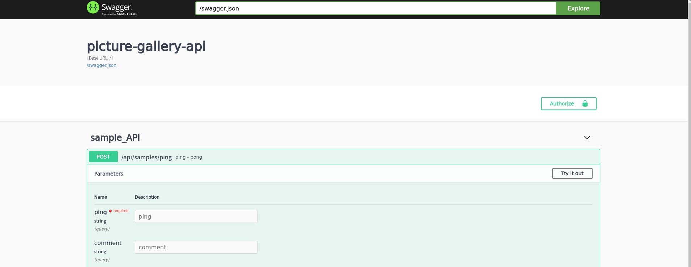

- [開発の流れの確認](#org0ac9762)
- [HTTP サーバを建てる](#org67c4688)
- [Test API の作成](#org6de44c5)
  - [Swagger のある生活](#org6275beb)
  - [ping - pong フローの確認](#orgecae71d)
  - [domain の作成](#orgf57a730)
  - [ルーティングを設定し、 Swagger を生やす](#org0819ade)
  - [swagger で API を試す](#org1109dd4)
- [付録 & 捕捉](#org9a07caa)
  - [logging 機能の設定](#org4b6d1cd)
  - [コードの全評価](#org54f1dd9)

<a id="org0ac9762"></a>

# 開発の流れの確認

ここまでで、REPL と integrant 、CLI を組み合わせて開発を行う準備が整いました。 以降からサーバ API 開発を行っていくわけですが、一旦ここで開発の流れ (諸説あり) を確認します。

1.  環境変数を設定する。

    `profiles.clj` を編集するか、 `export` を用いて、環境変数を設定します。特に DB の接続先を変えたり、 GCP のシークレットトークンを用いたりする際には、この工程が必須になります。

2.  REPL を立ち上げる。

    `lein repl` より (dev profile) 環境を立ち上げます。各エディタとこの REPL を連携することで、書いたコードの評価ができるようになります。

3.  機能を書く。

    - integrant の機能を書く。

      [integrant のドキュメント](https://github.com/weavejester/integrant#initializing-and-halting) に従って記述します。

    - integrant 外の機能を書く。

      Clean Architecture の様式に従って、domain、usecase などを記述します。

4.  config を更新する。

    `config.edn` を更新します。更新したら、 `dev.clj` で書いた `(restart)` を評価して反映します。 なお、 `config.edn` を更新する必要がなくとも、何らかの機能を更新した場合には `(restart)` を評価する必要があります。

基本的には 3, 4 を繰り返すことで開発を進めていきます。

<a id="org67c4688"></a>

# HTTP サーバを建てる

API は HTTP サーバに生えるので、HTTP サーバを建てます。 HTTP サーバの機能は、出力口にあたるので、Clean Architecture 的には `infrastructure` に含まれる部分と考えられます。

また今回は API サーバなので、ルーティングについても考える必要があります。 HTTP の `port=3000` 番ポートを開けて待ち受けることと、ルーティングすることは別なので、それぞれ別の機能とみなして実装を行っていきます。

依存関係を考えてまずはルーティング部分から記述します。 ルーティングは `reitit` (<https://github.com/metosin/reitit>) というライブラリを利用します。 2021 年のところルーティングにおいて、他ライブラリと比較して速度の面で有利であること、良質なドキュメントがあることのためです。

<details><summary>ルータのコード (picture-gallery.infrastructure.router.core)</summary>

```clojure
(ns picture-gallery.infrastructure.router.core
  (:require
   [reitit.ring :as ring]
   [reitit.core :as reitit]
   [reitit.coercion.spec]

   [reitit.swagger :as swagger]
   [reitit.swagger-ui :as swagger-ui]
   [reitit.ring.coercion :as coercion]

   [reitit.ring.middleware.muuntaja :as muuntaja]
   [reitit.ring.middleware.exception :as exception]
   [reitit.ring.middleware.multipart :as multipart]
   [reitit.ring.middleware.parameters :as parameters]
   [reitit.ring.middleware.dev :as dev]
   [reitit.ring.spec :as spec]

   [spec-tools.spell :as spell]
   [muuntaja.core :as m]

   [clojure.java.io :as io]

   [ring.logger :refer [wrap-with-logger]]
   [integrant.core :as ig]
   [taoensso.timbre :as timbre]

   [reitit.dev.pretty :as pretty]))

(defn app [env]
  (ring/ring-handler
   (ring/router
    [;; 後述する swagger のためのエンドポイント
     ["/swagger.json"
      {:get {:no-doc true
             :swagger {:info {:title "picture-gallery-api"}
                       :securityDefinitions
                       {:Bearer
                        {:type "apiKey"
                         :in "header"
                         :name "Authorization"}}
                       :basePath "/"}

             :handler (swagger/create-swagger-handler)}}]
     ;; "/api" 以下に機能を追加していく。
     ["/api"]]
    ;; 細かい設定
    {:exception pretty/exception
     :data {:coercion reitit.coercion.spec/coercion
            :muuntaja m/instance
            :middleware
            [;; swagger feature
             swagger/swagger-feature
             ;; query-params & form-params
             parameters/parameters-middleware
             ;; content-negotiation
             muuntaja/format-negotiate-middleware
             ;; encoding response body
             muuntaja/format-response-middleware
             ;; exception handling
             exception/exception-middleware
             ;; decoding request body
             muuntaja/format-request-middleware
             ;; coercing response bodys
             coercion/coerce-response-middleware
             ;; coercing request parameters
             coercion/coerce-request-middleware
             ;; multipart
             multipart/multipart-middleware]}})
   (ring/routes
    (swagger-ui/create-swagger-ui-handler {:path "/api"})
    (ring/create-default-handler))
   {:middleware [wrap-with-logger]}))

(defmethod ig/init-key ::router [_ {:keys [env]}]
  (timbre/info "router got: env" env)
  (app env))

;; halt-key! は何もしないので 省略できる
```

</details>

次に HTTP サーバ。同じく `reitit` ライブラリを参考に書きます。 `reitit` は Clojure ライブラリの中でもかなり開発・運用環境が良いので、API 開発時のルーティング (また、後に出てくる SPA クライアント側のルーティングにも) おすすめです。

参考: <https://github.com/metosin/reitit/blob/bdfae526bb7184dcb20d40800c81403d3430641d/examples/http/src/example/server.clj#L63-L65>

```clojure
(ns picture-gallery.infrastructure.server
  (:require [taoensso.timbre :as timbre]
            [ring.adapter.jetty :as jetty]
            [integrant.core :as ig]))

(defmethod ig/init-key ::server [_ {:keys [env router port]}]
  (timbre/info "server is running in port" port)
  (timbre/info "router is " router)
  (jetty/run-jetty router {:port port :join? false}))

;; server は 常駐アプリケーションなので、停止を強制させる必要がある。
;; 引数に与えられている server は init-key にある (jetty/run-jetty ...) で返される server
(defmethod ig/halt-key! ::server [_ server]
  (.stop server))
```

config を更新します。

```clojure
{:picture-gallery.infrastructure.env/env {}
 :picture-gallery.infrastructure.router.core/router {:env #ig/ref :picture-gallery.infrastructure.env/env}
 :picture-gallery.infrastructure.server/server {:env #ig/ref :picture-gallery.infrastructure.env/env
                                                :router #ig/ref :picture-gallery.infrastructure.router.core/router
                                                :port 3000}}
```

REPL で `(restart)` を評価してみます。

    (dev)=> (restart)
    loading environment via environ
    running in  dev
    log-level  :info
    orchestra instrument is active
    2021-03-13T14:41:44.588Z b343f5d53e9e INFO [picture-gallery.infrastructure.router.core:72] - router got: env {:running "dev", :log-level :info}
    2021-03-13T14:41:44.592Z b343f5d53e9e INFO [picture-gallery.infrastructure.server:7] - server is running in port 3000
    2021-03-13T14:41:44.592Z b343f5d53e9e INFO [picture-gallery.infrastructure.server:8] - router is  clojure.lang.AFunction$1@22b20c19
    ;; => :initiated
    (dev)=>

サーバが立ち上がったのを確認することができました。

<a id="org6de44c5"></a>

# Test API の作成

今回は Test API として ping - pong API を作ってみることにします。

ping - pong API とは /ping へリクエストを投げると &ldquo;pong&rdquo; という文字が返ってくる API です。 DB への接続もないので、非常にシンプルに作ることができます。

更に今後の開発のために、 Swagger と呼ばれる API の仕様記述のためのツールを使ってブラウザ上で ping - pong API をテストできるようにします。

<a id="org6275beb"></a>

## Swagger のある生活

サーバとクライアントの接続部分の情報共有をどのように行うのか。サーバ・クライアントアプリケーション (サービス) を開発する際にこの議題がしばしば挙がります。 (※ Rails / Django のようなサーバとクライアントを一つのプログラムで完結させるものを除く)

一般にサーバとクライアントは JSON を始めとする何らかのフォーマットにエンコードされたデータをやり取りし、それらを仕様として各プログラムは認識 / デコードします。

近年では、Swagger (OpenAPI) というツールがこの仕様共有のために注目されています。 Swagger は API のエンドポイントとそのエンドポイントで通信する際のデータ仕様をブラウザを用いて確認できるツールで、また、Swagger を Web クライアントとしてサーバとデータのやり取りをテストすることができます。

本ガイドでは、Swagger を **サーバ側のコードから自動生成する** ことで、Swagger の利用を行っていきます。

<a id="orgecae71d"></a>

## ping - pong フローの確認

今回扱う ping - pong API のフローを確認します。今回は練習のため comment という optional な 値を導入しました。

    client                               server
      |       +--------------------+       |
      |  ---  | /ping              |  -->  |
      |       |  'ping-message     |       |
      |       +--------------------+       |
      |                                    |
      |       +----------<success>-+       |
      |  <--  |  'pong-message     |  ---  |
      |       +--------------------+       |
      ~                                    ~
      |       +----------<failure>-+       |
      |  <--  |  'error-message    |  ---  |
      |       +--------------------+       |

- &rsquo;ping-message (query)

  ```clojure
    {:ping "ping"
     :comment "<optional string>"}
  ```

- &rsquo;pong-message (response body)

  ```clojure
  {:pong "pong"
   :comment "<optional string>"}
  ```

<a id="orgf57a730"></a>

## domain の作成

domain (entities) は取り扱うデータの仕様です。文字長のような制約も含めた仕様を記述していきます。

```clojure
(ns picture-gallery.domain.sample
  (:require [clojure.spec.alpha :as s]))

(def max-comment-length 1024)

(s/def ::ping (s/and string? (partial = "ping")))
(s/def ::pong (s/and string? (partial = "pong")))

(s/def ::not-exist-comment nil?)
(s/def ::exist-comment (s/and string? #(< (count %) max-comment-length)))
(s/def ::comment (s/or :not-exist-comment ::not-exist-comment
                       :exist-comment ::exist-comment))
```

REPL で動作確認をしてみましょう。

```clojure
(s/valid? ::ping "ping") ;; => true
(s/valid? ::ping 0)      ;; => false
(s/valid? ::ping "pong") ;; => false
```

動作確認を元に、テストを書いておきます。

```clojure
(ns picture-gallery.domain.sample-test
  (:require [picture-gallery.domain.sample :as sut]
            [picture-gallery.utils.string :as pg-string]
            [clojure.spec.alpha :as s]
            [clojure.test :as t]))

(t/deftest ping
  (t/is (not (s/valid? ::sut/ping "pong")))
  (t/is (not (s/valid? ::sut/ping 0)))
  (t/is (s/valid? ::sut/ping "ping")))

(t/deftest pong
  (t/is (not (s/valid? ::sut/pong "ping")))
  (t/is (not (s/valid? ::sut/pong 0)))
  (t/is (s/valid? ::sut/pong "pong")))

(t/deftest _comment
  (t/is (s/valid? ::sut/comment nil))
  (t/is (s/valid? ::sut/comment "hello"))
  (t/is (not (s/valid? ::sut/comment (pg-string/rand-str 2048)))))
```

なお、動作確認、テストの段階で仕様に漏れがあれば、修正を施しましょう。

<a id="org0819ade"></a>

## ルーティングを設定し、 Swagger を生やす

API でどのようなデータをやり取りするのかがわかったところで、早速エンドポイントを作っていきます。

まずは条件を無視して、サンプルのデータをやり取りするだけのエンドポイントを作ります。

1.  ルータ

    ```clojure
    (ns picture-gallery.infrastructure.router.sample
      (:require [picture-gallery.domain.openapi.sample :as sample-openapi]
                [picture-gallery.interface.controller.api.sample.ping-post :as ping-post-controller]
                [picture-gallery.usecase.sample.ping-pong :as ping-pong-usecase]
                [picture-gallery.interface.presenter.api.ping-post :as ping-post-presenter]
                [picture-gallery.utils.error :refer [err->>]]))

    ;; handlers
    (defn ping-post-handler [input-data]
      (ping-post-presenter/->http ;; 出力データにフォーマットする
       (err->> input-data  ;; 入力データを
               ping-post-controller/http-> ;; フォーマットして
               ping-pong-usecase/ping-pong ;; 処理する
               )))

    ;; router
    (defn sample-router []
      ["/samples"
       ["/ping"
        {:swagger {:tags ["sample_API"]}
         :post {:summary "ping - pong"
                :parameters {:query ::sample-openapi/post-ping-query-parameters}
                :responses {200 {:body ::sample-openapi/post-ping-response}}
                :handler ping-post-handler}}]])
    ```

2.  ハンドラの内部

    Clean Architecture 的には入力データの処理を controller、ロジックを usecase、出力を presenter で行うので、それに従って書いていきます。(先にルータですべてのコードを書いて、後で分割していく方が楽かもしれません。)

- controller

  <details><summary>controller のコード</summary>

  ```clojure
  (ns picture-gallery.interface.controller.api.sample.ping-post
    (:require [clojure.spec.alpha :as s]
              [picture-gallery.domain.sample :as sample-domain]
              [picture-gallery.domain.error :as error-domain]
              [picture-gallery.domain.openapi.sample :as sample-openapi]))

  (s/def ::query ::sample-openapi/post-ping-query-parameters)
  (s/def ::parameters (s/keys :req-un [::query]))
  (s/def ::http-input-data (s/keys :req-un [::parameters]))

  (s/fdef http->
    :args (s/cat :input-data ::http-input-data)
    :ret (s/or :success (s/tuple ::sample-domain/ping-pong-input nil?)
               :failure (s/tuple nil? ::error-domain/error)))

  (defn http-> "
    http request -> usecase input model
    "
    [input-data]
    (let [{:keys [parameters]} input-data
          {:keys [query]} parameters
          {:keys [ping comment]} query
          input-model   (cond-> {:ping (:ping query)}
                          comment (assoc :comment comment))
          conformed-input-model (s/conform
                                 ::sample-domain/ping-pong-input
                                 input-model)]
      (if (not= ::s/invalid conformed-input-model)
        [conformed-input-model nil]
        [nil (error-domain/input-data-is-invalid (s/explain-str ::sample-domain/ping-pong-input input-model))])))
  ```

  </details>

- usecase

  ```clojure
       (ns picture-gallery.usecase.sample.ping-pong
         (:require [clojure.spec.alpha :as s]
                   [picture-gallery.domain.sample :as sample-domain]
                   [picture-gallery.domain.error :as error-domain]
                   [orchestra.spec.test :as st]))

       (s/fdef ping-pong
         :args (s/cat :input-model ::sample-domain/ping-pong-input)
         :ret (s/or :success (s/cat :ping-pong-output ::sample-domain/ping-pong-output :error nil?)
                    :failure (s/cat :ping-pong-output nil? :error ::error-domain/error)))

       ;; ここを後で編集する (ロジックが空)
       (defn ping-pong [input-model]
         (let [{:keys [ping comment]} input-model
               output-model {:pong "pong"}]
           [output-model nil]))
  ```

- presenter

  <details></summary>presenter のコード</summary>

  ```clojure
     (ns picture-gallery.interface.presenter.api.ping-post
       (:require [clojure.spec.alpha :as s]
                 [picture-gallery.domain.sample :as sample-domain]
                 [picture-gallery.domain.openapi.sample :as sample-openapi]
                 [picture-gallery.domain.openapi.base :as base-openapi]
                 [picture-gallery.domain.error :as error-domain]
                 [orchestra.spec.test :as st]))

     (s/def ::body ::sample-openapi/post-ping-response)
     (s/def ::http-output-data (s/keys :req-un [::base-openapi/status ::body]))
     (s/fdef ->http
       :args (s/cat :arg
                    (s/or :success (s/tuple ::sample-domain/ping-pong-output nil?)
                          :failure (s/tuple nil? ::error-domain/error)))
       :ret (s/or :success ::http-output-data
                  :failure ::error-domain/error))

     (defn ->http "
       usecase output model -> http response
       "
       [[output-data error]]
       (if (nil? error)
         {:status 200
          :body output-data}
         error))
  ```

  </details>

最後に、大元のルータに接続します。

```clojure
(defn app []
  (ring/ring-handler
   (ring/router
    [["/swagger.json"
      {:get {:no-doc true
             :swagger {:info {:title "picture-gallery-api"}
                       :securityDefinitions
                       {:Bearer
                        {:type "apiKey"
                         :in "header"
                         :name "Authorization"}}
                       :basePath "/"}

             :handler (swagger/create-swagger-handler)}}]
     ["/api"
      (sample-router/sample-router) ;; "/api" 以下に生やしていく
      ]]
    ;; ...
    )))
```

すべて記述するとともに、 **実装した関数を評価したら [4.2](#org54f1dd9)** 、 `(restart)` より環境を更新します。 なお、実装した関数を評価していないと、正しく動作しません。

Swagger にアクセスして確かめてみましょう。ブラウザの `localhost:3000/api` より Swagger の画面にアクセスできます。



<a id="org1109dd4"></a>

## swagger で API を試す

試しに ping に &ldquo;ping&rdquo; を入力して 実行すると、

```json
{ "pong": "pong" }
```

と返ってきます。これは期待通りですね。

ping に &ldquo;hello&rdquo; を入力すると、以下のようなエラーが返ってきます。これは、controller ([3.4](#org0819ade)) で `s/conform` した際に、 domain の ping の仕様 (`:picture-gallery.domain/sample/ping`) に違反しているためです。

```json
{
  "code": 1,
  "message": "input data is invalid: \"hello\" - failed: (partial = \"ping\") in: [:ping] at: [:ping] spec: :picture-gallery.domain.sample/ping\n"
}
```

次に、 ping に &ldquo;ping&rdquo;、 comment に &ldquo;hello world&rdquo; を入力してみましょう。 comment がレスポンスに含まれていません。これは仕様とは違いますね。入力や出力の変換部分ではなく、usecase の未実装が原因です (※本来はテストでカバーできている場面ですが、Swagger に慣れてもらうために、意図的にテストを飛ばしています)。

```json
{ "pong": "pong" }
```

usecase ([3.4](#org0819ade)) を見ると、 comment を output モデルに追加していないことがわかるので、これを追加します。 つまり以下のように修正します。

```clojure
(defn ping-pong [input-model]
  (let [{:keys [ping comment]} input-model
        output-model (cond-> {:pong "pong"}
                       ;; もし comment があれば、 assoc 関数を用いて comment を追加する
                       comment (assoc :comment comment))]
    [output-model nil]))
```

修正を反映して、再度 swagger で試してみましょう。

```json
{
  "pong": "pong",
  "comment": "hello world"
}
```

期待する結果を得ることができました。

<a id="org9a07caa"></a>

# 付録 & 捕捉

<a id="org4b6d1cd"></a>

## logging 機能の設定

log の設定機能を追加します。 **timbre** というライブラリを呼び出すだけなのでほとんどコードはないです。

```clojure
(ns picture-gallery.infrastructure.logger
  (:require [taoensso.timbre :as timbre]
            [integrant.core :as ig]))

(defmethod ig/init-key ::logger [_ {:keys [env]}]
  (println "set logger with log-level" (:log-level env))
  (timbre/set-level! (:log-level env))
  {})
```

環境変数からログの出力レベルを得たいので、config に `:env` の依存関係を追加します。

```clojure
{:picture-gallery.infrastructure.env/env {}
 :picture-gallery.infrastructure.logger/logger {:env #ig/ref :picture-gallery.infrastructure.env/env}}
```

<a id="org54f1dd9"></a>

## コードの全評価

Emacs の開発環境である、 Cider では、 `cider-eval-all-files` というコマンドで、指定したディレクトリ以下の今まで記述したコードのすべてを評価することができます。

また、VSCode の Calva では、コードを保存すると評価するオプション `Eval On Save` が存在します。
