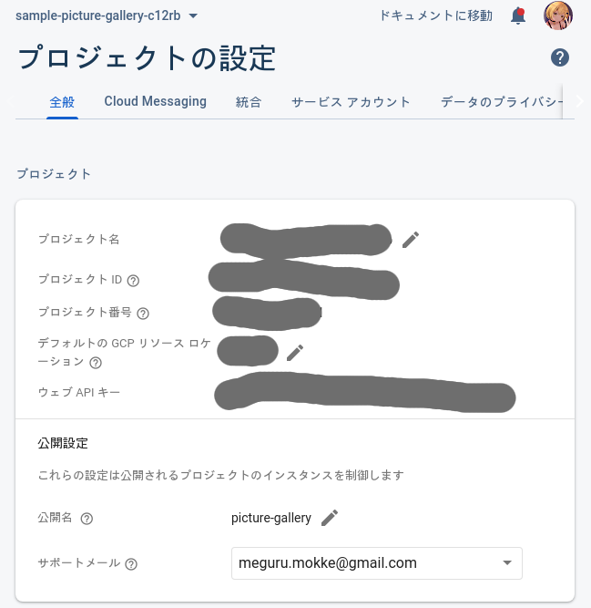
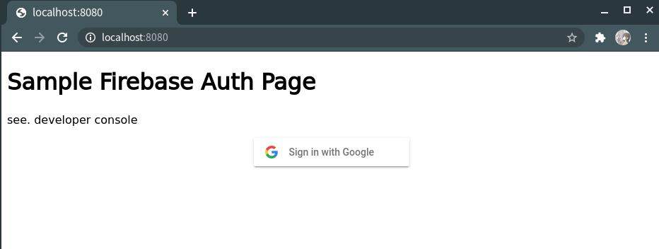
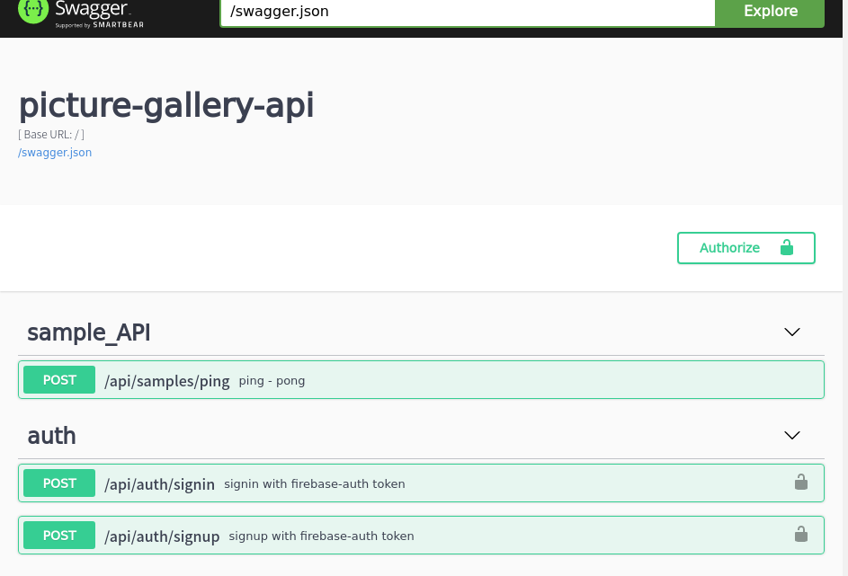
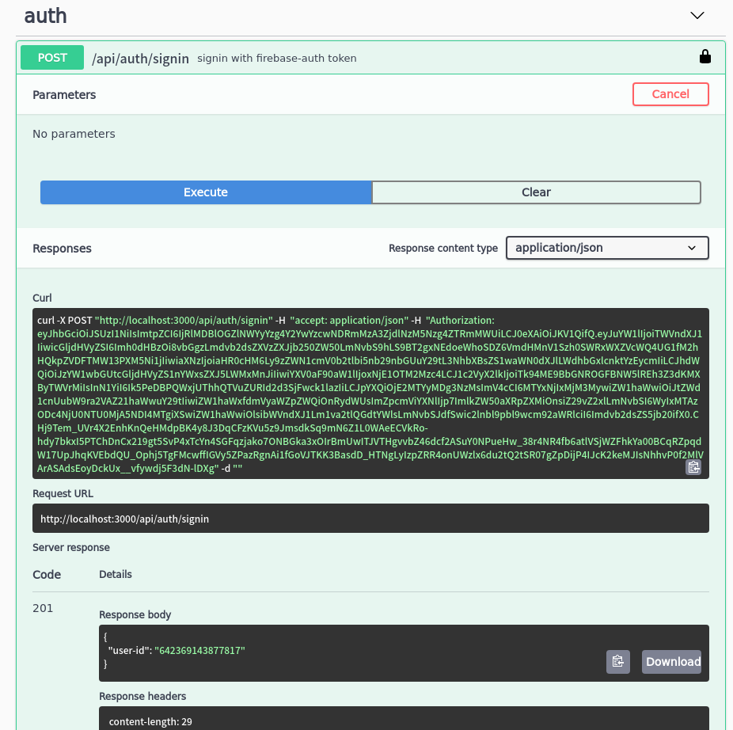

- [Firebase Auth の準備](#org298c1ff)
- [仮フロントエンドの作成](#orgf2641c5)
- [サインアップ・サインイン・サインアウトフローの確認](#org8d7af9f)
  - [サインアップ](#org2ec28ea)
  - [サインイン](#org0aad4a4)
  - [サインアウト](#orgee4c7b6)
- [ドメイン・ハンドラの作成](#orgd4478e4)
  - [domain](#org87035a2)
  - [ルータ & ハンドラ](#org2c65609)
- [infrastructure の実装](#org375840b)
  - [Firebase Auth の token 読み込み](#org7b5785d)
  - [DB の接続](#orgd8bd39b)
  - [マイグレーション](#orgafe0f90)
    - [実装方針](#org4305bab)
    - [マイグレーションファイルを書く](#orgd07814d)
    - [integrant のコードを書く](#org48cf32e)
    - [CLI スクリプトを書く](#org86ebe3a)
    - [サーバ用コードに埋め込む](#orgf473b37)
- [interface の実装](#org65537ca)
  - [Firebase Auth の token デコード機構](#orga0db6ec)
  - [SQL の実行機構](#org95986f7)
- [interface の組み込み](#orgad0522a)
  - [サインアップ](#org7bfc030)
  - [サインイン](#orgfaff47e)
  - [実装](#orgc9fbbc4)
    - [サインアップ](#org0f84422)
    - [サインイン](#orge9cd8dc)
    - [ハンドラの修正](#org4670042)
- [動作確認](#orgd4f75bb)
- [付録・捕捉](#org07a9471)
  - [実装してみます](#orga6c9efe)
  - [ランダムな数列と衝突確率](#org63ece35)
  - [テスト用データベースのセットアップ](#org2e3067b)

本稿では、Web API を作っていく上で頻出する認証・認可周りの話を、Firebase Auth を用いて片付けます。 一般的に パスワード認証などが基礎のガイドでは紹介されますが、 refresh token を代表とする罠が多すぎるので、外部サービスを利用します。

ただし、この手法は、(同等の機能を自前の認証サーバを用いることで実装できるとはいえ) Firebase への依存度が極めて高いため、 **技術的負債になる** 点に注意して下さい。

<a id="org298c1ff"></a>

# Firebase Auth の準備

1.  Firebase Project よりプロジェクトを追加します。 アナリティクスの追加の有無を聞かれますが、必要に応じて切り替えて下さい。
2.  左メニューの構築タブにある、Authentication より、 Auth のための設定を行います。

    1.  `Sign-in method` より、 Google を有効にします。 Twitter や Yahoo など他のプロバイダもありますが、 Google が以降の設定について一番楽だと思われます。

        アプリの公開名は、わかりやすい名前 (e.g. 本ガイドで言えば、picture-gallery)を設定すると良いでしょう。

    2.  承認済みドメインに `localhost` が指定されていることを確認して下さい。

        公開時には、公開するドメイン (github pages ならば、 xxx.github.io など) を設定する必要があります。

    3.  プロジェクトの設定 → 全般より、 `プロジェクト名` と `プロジェクトID` を入手して下さい。

        

    4.  プロジェクトの設定 → サービスアカウントより、新しい秘密鍵を生成して下さい。生成した秘密鍵の入った JSON ファイルは、 `resources/secrets` に `firebase_secrets.json` として保存して下さい (後の説明のため必要です)。

    5.  `firebase_secrets.json` を Github ないし **外部へ共有しないように設定して下さい** 。

        ファイルは gpg コマンドを使って暗号化するなどの処理をしましょう。

        ```shell
        # 共通鍵暗号化方式で暗号化する例
        gpg -c firebase_secrets.json
        ```

参考:

- <https://firebase.google.com/docs/auth/web/google-signin?authuser=1#before_you_begin>
- <https://firebase.google.com/docs/admin/setup?hl=ja#initialize-sdk>

<a id="orgf2641c5"></a>

# 仮フロントエンドの作成

Firebase Auth はフロントエンドと Firebase の認証サーバとの通信を繋げて認証情報を獲得します。 そのため、 **フロントエンドの実装が必須** となります。

今回はまず、認証情報を自前の DB に API サーバを通してに持ち込む流れを実装していくので、仮のフロントエンドを作成します。

仮フロントエンドは、http-server (<https://github.com/http-party/http-server>) と １枚の `index.html` を用いて作成します。 まずは仮フロントエンドのプロジェクト作成をします。

```shell
# npm > 5.2.0
mkdir fba_front_sample
cd fba_front_sample
npm init -y
npm install -D http-server
```

次に、index.html を作成します。

<details><summary>index.html (`set your values from firebase project` 部を編集して下さい)</summary>

```html
<!doctype html>
<html>
    <head>
        <meta charset="utf-8">
        <meta http-equiv="x-ua-compatible" content="ie=edge">
        <meta name="viewport" content="width=device-width, initial-scale=1">

        <script src="https://www.gstatic.com/firebasejs/ui/4.6.1/firebase-ui-auth.js"></script>
        <link type="text/css" rel="stylesheet" href="https://www.gstatic.com/firebasejs/ui/4.6.1/firebase-ui-auth.css" />
    </head>
    <body>
        <!-- The surrounding HTML is left untouched by FirebaseUI.
             Your app may use that space for branding, controls and other customizations.-->
        <h1>Sample Firebase Auth Page</h1>
        <div>see. developer console</div>
        <div id="firebaseui-auth-container"></div>
        <div id="loader">Loading...</div>
        <button id="signout">SignOut</div>

        <script src="https://www.gstatic.com/firebasejs/8.2.9/firebase-app.js"></script>
        <script src="https://www.gstatic.com/firebasejs/8.2.9/firebase-auth.js"></script>
        <script type="text/javascript">

         // set your values from firebase project
         // --------------------------------------------
         var apiKey = <your apiKey>
         var projectId = <your project id>
         // --------------------------------------------

         var authDomain = projectId + ".firebaseapp.com"
         var firebaseConfig = {
             apiKey: apiKey,
             authDomain:  authDomain,
             projectId: projectId,
         }
         firebase.initializeApp(firebaseConfig);

         // Initialize the FirebaseUI Widget using Firebase.
         var uiConfig = {
             callbacks: {
                 signInSuccessWithAuthResult: function(authResult, redirectUrl){ return true;},
                 uiShown: function() { document.getElementById("loader").style.display='none'; }
             },
             signInFlow: 'redirect',
             signInSuccessUrl: '/',
             signInOptions: [
                 firebase.auth.GoogleAuthProvider.PROVIDER_ID,
             ]
         }

         var ui = new firebaseui.auth.AuthUI(firebase.auth());
         var signOutButton = document.getElementById("signout");
         // default state
         ui.start('#firebaseui-auth-container', uiConfig);
         signOutButton.style.display='none'

         // already signIned
         firebase.auth().onAuthStateChanged((user) => {
             if (user) {
                 firebase.auth().currentUser.getIdToken(true).then(function(idToken) {
                     console.log("id token is below:")
                     console.log(idToken);
                 })
                 ui.delete()
                 signOutButton.style.display='block'
             }
         })

         // signout
         signOutButton.addEventListener('click', function() {
             console.log("signout")
             firebase.auth().signOut().then(_ => {
                 location.reload()
             })
         })


        </script>

    </body>
</html>
```

</details>

ここまでのプロジェクトのディレクトリ構造は次のようになります。

    .
    ├── index.html
    ├── node_modules
    ├── package-lock.json
    └── package.json

`npx run http-server .` より、http サーバを立ち上げ、 `localhost:8080` より `index.html` へアクセスします。



ログインすると、開発者コンソールに idToken が表示されます。この idToken がサーバへ受け渡したい認証情報となります。

なお、この **認証情報は有効期限がある** ため、 API をテストする際には最新のものを利用する必要があります。

<a id="org8d7af9f"></a>

# サインアップ・サインイン・サインアウトフローの確認

実装をする前に、今回作る機能の利用フローを考えます。

<a id="org2ec28ea"></a>

## サインアップ

    client                                server
       |                                    |
       |     +------------------------+     |
       | --- | /signup                | --> |
       |     |  'signup-param         |     |
       |     +------------------------+     |
       |                                    |
       |       +----------<success>-+       |
       |  <--  |  'signup-success   |  ---  |
       |       +--------------------+       |
       ~                                    ~
       |       +----------<failure>-+       |
       |  <--  |  'error-message    |  ---  |
       |       +--------------------+       |

- &rsquo;signup-param

  今後作る機能と一貫性を持たせるために、認証情報 (`idToken`) はクエリやボディではなく、ヘッダに乗せます。

  ```clojure
    {:header "<idToken>"}
  ```

- &rsquo;signup-success

  user-id はユーザに与えられる一意な数列です (e.g. `019012323149`) 。(今回は 15 桁の数字列としましたがスケールなど考えると uuid などのほうが良いです。)

  ```clojure
    {:user-id "<userId>"}
  ```

<a id="org0aad4a4"></a>

## サインイン

    client                                server
       |                                    |
       |     +------------------------+     |
       | --- | /signin                | --> |
       |     |  'signin-param         |     |
       |     +------------------------+     |
       |                                    |
       |       +----------<success>-+       |
       |  <--  |  'signin-success   |  ---  |
       |       +--------------------+       |
       ~                                    ~
       |       +----------<failure>-+       |
       |  <--  |  'error-message    |  ---  |
       |       +--------------------+       |

- &rsquo;signin-param

  signin と同様です。

  ```clojure
    {:header "<idToken>"}
  ```

- &rsquo;signin-success

  signup と同様です。ただし、 signup の `user-id` は生成されるものですが、こちらは検索して得られるものです。

  ```clojure
    {:user-id "<userId>"}
  ```

<a id="orgee4c7b6"></a>

## サインアウト

サインイン状態の管理は Firebase Auth 側が受け持っているので、こちらが行うことはありません。 (他アプリ開発をしている上で必要となるケースもあるかもしれませんが、今回は扱いません。)

<a id="orgd4478e4"></a>

# ドメイン・ハンドラの作成

今回も見通しを良くするために usecase の詳細を省いた実装を先に行います。

<a id="org87035a2"></a>

## domain

※ **domain は ORM ではない** ので、SQL のテーブルを意識して domain を作るのはおすすめできません。(ORM を意識すると domain が SQL に依存してしまう。とはいえ普通に設計して ORM っぽくなったりすることもあります。)

今回問題になるのは、 firebase auth の `id-token` です。firebase auth の 仮フロントエンドから渡される id-token (`encrypted-id-token`) は、サーバ内で外部ライブラリによって復号され一意のユーザトークン (`id-token`) になります。

またユーザ ID は衝突確率などを考慮して [9.2](#org63ece35) 、 15 桁の数字列としました。

- firebase auth の domain

  ```clojure
  (ns picture-gallery.domain.auth
    (:require [clojure.spec.alpha :as s]
              [picture-gallery.domain.users :as users-domain]
              [picture-gallery.domain.error :as error-domain]
              [picture-gallery.domain.base :as base-domain]))

  (s/def ::encrypted-id-token string?)

  ;; ここは usecase の in-out にまつわるモデルの話
  (s/def ::signin-input
    (s/keys :req-un [::encrypted-id-token]))

  (s/def ::signin-output
    (s/keys :req-un [::users-domain/user-id]))

  (s/def ::signup-input
    (s/keys :req-un [::encrypted-id-token]))

  (s/def ::signup-output
    (s/keys :req-un [::users-domain/user-id]))

  ;; ここは interface の encrypyed-id-token デコード周りの話
  (s/def ::decode-id-token-succeed
    (s/tuple ::base-domain/success ::users-domain/id-token))

  (s/def ::decode-id-token-failed
    (s/tuple ::base-domain/failure ::error-domain/error))

  (s/def ::decode-id-token-result
    (s/or :success ::decode-id-token-succeed
          :failure ::decode-id-token-failed))
  ```

- user の domain

  ```clojure
  (ns picture-gallery.domain.users
    (:require [clojure.spec.alpha :as s]))

  (defn user-id? [num-str]
    (re-matches #"^[0-9]{15}" num-str))

  (defn gen-user-id []
    (apply str (take 15 (repeatedly #(rand-int 10)))))

  (s/def ::user-id (s/and string? user-id?))
  (s/def ::id-token string?)
  (s/def ::created-at pos-int?)

  ;; ユーザのモデル
  (s/def ::user-create-model
    (s/keys :req-un [::user-id ::id-token]))

  (s/def ::user-model
    (s/keys :req-un [::user-id ::id-token ::created-at]))

  (s/def ::users-model
    (s/coll-of ::user-model))
  ```

- swagger での auth (signin/signup) の domain

  ```clojure
  (ns picture-gallery.domain.openapi.auth
    (:require [clojure.spec.alpha :as s]))

  (s/def ::user-id string?)

  (s/def ::signin-response (s/keys :req-un [::user-id]))
  (s/def ::signup-response (s/keys :req-un [::user-id]))
  ```

<a id="org2c65609"></a>

## ルータ & ハンドラ

controller、 usecase、 presenter など詳細な実装は、この後実装するので省略します。

```clojure
(ns picture-gallery.infrastructure.router.auth
  (:require [picture-gallery.usecase.signin :as signin-usecase]
            [picture-gallery.domain.openapi.auth :as auth-openapi]
            [clojure.walk :as w]
            [picture-gallery.utils.error :refer [err->>]]))

(defn signin-post-handler [input-data]
  (println (-> input-data :headers w/keywordize-keys :authorization))
  {:status 201
   :body {:user-id "123123123123123"}})

(defn signup-post-handler [input-data]
  {:status 201
   :body {:user-id "123123123123123"}})

(defn auth-router []
  ["/auth"
   ["/signin"
    {:swagger {:tags ["auth"]}
     :post {:summary "signin with firebase-auth token"
            :swagger {:security [{:Bearer []}]}
            :responses {201 {:body ::auth-openapi/signin-response}}
            :handler signin-post-handler}}]
   ["/signup"
    {:swagger {:tags ["auth"]}
     :post {:summary "signup with firebase-auth token"
            :swagger {:security [{:Bearer []}]}
            :responses {201 {:body ::auth-openapi/signup-response}}
            :handler signup-post-handler}}]])
```

ルータのルートに組み込みましょう。

```clojure
(ns picture-gallery.infrastructure.router.core
  (:require
   ;; ...
   [picture-gallery.infrastructure.router.sample :as sample-router]
   [picture-gallery.infrastructure.router.auth :as auth-router]))

(defn app []
  (ring/ring-handler
   (ring/router
    [["/swagger.json"]
      ;; ...
     ["/api"
      (sample-router/sample-router)
      (auth-router/auth-router) ;; add here!
      ]]
    ;; ...
    )))
```

`(restart)` して、Swagger を確認します。



右上に `Authorize` というボタンがあります。 Swagger では、このボタンより、header の `apiKey` の入力ができるようになっています。 試しに、 &ldquo;sample&rdquo; と入力し、 `/api/auth/signin` を実行すると、REPL のログに次の行が記録されます。

    apiKey: sample

繰り返しますが、今回はこの apiKey に firebase auth の id-token を入力していくことになります。

<a id="org375840b"></a>

# infrastructure の実装

Firebase や DB とやり取りをするためにそれぞれとの接続を作る必要があります。この部分は Clean Architecture 的には infrastructure にあたります。

<a id="org7b5785d"></a>

## Firebase Auth の token 読み込み

[1](#org298c1ff) で用意した、 `resources/secrets/firebase_secrets.json` を読み込んで encrypted-id-token をデコードするための準備を行います。 今回はライブラリのドキュメントを信用して説明を省略していますが、時間があれば **API ドキュメントを読んだほうが良いです** (~~サンプルが古すぎるなど~~) 。

```clojure
(ns picture-gallery.infrastructure.firebase.core
  (:import (com.google.firebase FirebaseApp FirebaseOptions))
  (:require [integrant.core :as ig]
            [taoensso.timbre :as timbre]))

;; いわゆる型、firebaseApp という値をコンストラクタに取る、と考えると良い
(defrecord FirebaseBoundary [firebaseApp])

(defmethod ig/init-key ::firebase
  [_ {:keys [env]}]
  (let [firebase-credentials (:firebase-credentials env)
        firebase-options (FirebaseOptions/builder)
        firebaseApp (-> firebase-options
                        (.setCredentials firebase-credentials)
                        .build
                        FirebaseApp/initializeApp)]
    (timbre/info "connectiong to firebase with " firebase-credentials)
    (->FirebaseBoundary {:firebase-app firebaseApp
                         :firebase-auth (FirebaseAuth/getInstance)})))


(defmethod ig/halt-key! ::firebase
  [_ boundary]
  (->
   boundary
   .firebase
   :firebase-app
   .delete))
```

参考: <https://firebase.google.com/docs/admin/setup?hl=ja#initialize-sdk>

config を編集します。

```clojure
{:picture-gallery.infrastructure.env/env {}
 :picture-gallery.infrastructure.logger/logger {:env #ig/ref :picture-gallery.infrastructure.env/env}
 :picture-gallery.infrastructure.firebase.core/firebase {:env #ig/ref :picture-gallery.infrastructure.env/env}
 :picture-gallery.infrastructure.router.core/router {:env #ig/ref :picture-gallery.infrastructure.env/env
                                                     :firebase #ig/ref :picture-gallery.infrastructure.firebase.core/firebase}
 :picture-gallery.infrastructure.server/server {:env #ig/ref :picture-gallery.infrastructure.env/env
                                                :router #ig/ref :picture-gallery.infrastructure.router.core/router
                                                :port 3000}}
```

`firebase_secrets.json` のファイル位置は環境変数から教える必要があるので、簡単のために script ファイルを作ります。

```shell
# env.sh
echo "please run as \"source env.sh\""

export GOOGLE_APPLICATION_CREDENTIALS="resources/secrets/firebase_secrets.json"
```

REPL を再起動し、 `(start)` してみましょう。ログに `picture-gallery.infrastructure.firebase.core` の INFO が流れていることが確認できます。

    dev=> (start)
    loading environment via environ
    running in  dev
    database-url  jdbc:postgresql://dev_db:5432/picture_gallery_db?user=meguru&password=emacs
    log-level  :info
    orchestra instrument is active
    2021-03-16T15:52:05.347Z f04004b3a5e3 INFO [picture-gallery.infrastructure.firebase.core:16] - connectiong to firebase with  ServiceAccountCredentials{clientId=107926774701607421850, clientEmail=firebase-adminsdk-l42c5@sample-picture-gallery-c12rb.iam.gserviceaccount.com, privateKeyId=80f9a8cceb5036d0a96f73a108fa485aeed314a4, transportFactoryClassName=com.google.auth.oauth2.OAuth2Utils$DefaultHttpTransportFactory, tokenServerUri=https://oauth2.googleapis.com/token, scopes=[], serviceAccountUser=null, quotaProjectId=null}
    # ...

<a id="orgd8bd39b"></a>

## DB の接続

次に DB の接続を行います。 今回は PostgreSQL を用います。 使うライブラリは hirari-cp (<https://github.com/tomekw/hikari-cp>) です。 hikari-cp は 高速に db のコネクションプールを作ることができるライブラリです。

`docker-compose` より、 `dev_db` の `port=5432` から PostgreSQL がコンニチハしていることがわかるので、環境変数のセットアップから先に行います。

`profiles.clj` を次のように編集します。 `database-<option-name>` がちょうど環境変数のセットアップに必要な設定です。

```clojure
{:profiles/dev
 {:env
  {:env "dev"
   :database-adapter "postgresql"
   :database-name "pic_gallery"
   :database-username "meguru"
   :database-password "emacs"
   :database-server-name "dev_db"
   :database-port-number "5432"
   :log-level "info"}}}
```

これに従って、 `env.clj` も更新します。

```clojure
(defn get-database-options []
  {:adapter (env :database-adapter)
   :database-name "pic_gallery"
   :username (env :database-username)
   :password (env :database-password)
   :server-name (env :database-server-name)
   :port-number (Integer/parseInt (env :database-port-number))})

(defmethod ig/init-key ::env [_ _]
  (println "loading environment via environ")
  (let [database-options (get-database-options)
        running (env :env)
        log-level (decode-log-level (env :log-level))]
    (println "running in " running)
    (println "log-level " log-level)
    (println "database options" database-options)
    (when (.contains ["test" "dev"] running)
      (println "orchestra instrument is active")
      (st/instrument))
    {:database-options database-options
     :running running
     :log-level log-level
     :firebase-credentials (GoogleCredentials/getApplicationDefault)}))
```

実行サンプルはこんな感じ。

    loading environment via environ
    running in  dev
    log-level  :info
    database options {:adapter postgresql, :username meguru, :password emacs, :server-name dev_db, :port-number 5432}
    orchestra instrument is active
    # ...

次に、infrastructure のコードを書きます。 残念ながら、SQL クエリ周りのログは分離することが困難だったので、本コードの中に含めています。

```clojure
(ns picture-gallery.infrastructure.sql.sql
  (:require [integrant.core :as ig]
            [hikari-cp.core :as hikari-cp]
            [taoensso.timbre :as timbre])
  (:import
   [javax.sql DataSource]
   [net.ttddyy.dsproxy QueryInfo]
   [net.ttddyy.dsproxy.support ProxyDataSource]
   [net.ttddyy.dsproxy.listener QueryExecutionListener]))

(defrecord Boundary [spec])

;; define logging
(defn- query-parameters [params]
  (->> params (map (memfn getArgs)) (sort-by #(aget % 0)) (mapv #(aget % 1))))

(defn- query-parameter-lists [^QueryInfo query-info]
  (mapv query-parameters (.getParametersList query-info)))

(defn- logged-query [^QueryInfo query-info]
  (let [query  (.getQuery query-info)
        params (query-parameter-lists query-info)]
    (into [query] (if (= (count params) 1) (first params) params))))

(defn- logging-listener []
  (reify QueryExecutionListener
    (beforeQuery [_ _ _])
    (afterQuery [_ exec-info query-infos]
      (let [elapsed (.getElapsedTime exec-info)
            queries (mapv logged-query query-infos)]
        (if (= (count queries) 1)
          (timbre/info "sql/query" {:query (first queries) :elapsed elapsed})
          (timbre/info "sql/batch-query" {:queries queries :elapsed elapsed}))))))

(defn wrap-logger [datasource]
  (doto (ProxyDataSource. datasource)
    (.addListener (logging-listener))))

(defn unwrap-logger [^DataSource datasource]
  (.unwrap datasource DataSource))


;; integrant keys
(defmethod ig/init-key ::sql
  [_ {:keys [env logger]}]
  (let [datasource
        (-> (:database-options env)
          (hikari-cp/make-datasource)
          wrap-logger)]
    (timbre/info "setup connection pool ...")
    (->Boundary {:datasource
                 datasource})))

(defmethod ig/halt-key! ::sql
  [_ boundary]
  (timbre/info "close connection pool ...")
  (-> boundary
      .spec
      :datasource
      unwrap-logger
      hikari-cp/close-datasource))
```

実行例は次のようになります。

    (dev)> (start)
    ;; ...
    2021-03-16T20:59:29.564Z f04004b3a5e3 INFO [com.zaxxer.hikari.HikariDataSource:80] - HikariPool-19 - Starting...
    2021-03-16T20:59:29.568Z f04004b3a5e3 INFO [com.zaxxer.hikari.HikariDataSource:82] - HikariPool-19 - Start completed.
    2021-03-16T20:59:29.569Z f04004b3a5e3 INFO [picture-gallery.infrastructure.sql.sql:56] - setup connection pool ...
    ;; => :resumed
    dev>

参考:

- <https://github.com/tomekw/hikari-cp/blob/master/src/hikari_cp/core.clj> の `core-options`
- <https://github.com/brettwooldridge/HikariCP> Java の HikariCP (hikari-cp の参照元)
- <https://github.com/duct-framework/database.sql.hikaricp> hikari-cp への logging 実装

<a id="orgafe0f90"></a>

## マイグレーション

<a id="org4305bab"></a>

### 実装方針

DB との接続ができたところで、次に DB マイグレーションの設定を行います。 これは ragtime (<https://github.com/weavejester/ragtime>) を利用します。

マイグレーションで行いたいことは次の 2 つです。

1.  マイグレート マイグレーションのファイルに基づいて DB を掘ります。
2.  ロールバック マイグレーションしたものを i (> 1) 個だけ元に戻します。

<a id="orgd07814d"></a>

### マイグレーションファイルを書く

まずマイグレーションファイルを書きます。ragtime のマイグレーションはマイグレート用の up.sql と、ロールバック用の down.sql を書く必要があります。

- 001_users.up.sql

  ```sql
  -- 001_users.up.sql
  CREATE TABLE users (
         id varchar(15) PRIMARY KEY,
         auth_token varchar(64) NOT NULL,
         created_at TIMESTAMP default CURRENT_TIMESTAMP,
         updated_at TIMESTAMP,
         is_deleted BOOLEAN NOT NULL default FALSE
  );
  ```

- 001_users.down.sql

  ```sql
  -- 001_users.down.sql
  DROP TABLE users;
  ```

<a id="org48cf32e"></a>

### integrant のコードを書く

マイグレーションのコードそのものは ragtime のドキュメントを参考にしつつ、integrant のシステムと組み合わせる形でまとめます。

このコードではマイグレートとロールバックを分岐させるために、 `operation` キーを用いました。

```clojure
(ns picture-gallery.infrastructure.sql.migrate
  (:require [ragtime.jdbc :as jdbc]
            [ragtime.repl :as repl]
            [integrant.core :as ig]
            [taoensso.timbre :as timbre]))

(defn build-config [database-options migration-folder]
  (let [{:keys [adapter database-name username password server-name port-number]} database-options]
    {:datastore (jdbc/sql-database {:dbtype adapter
                                    :dbname database-name
                                    :user username
                                    :password password
                                    :port port-number
                                    :host server-name})
     :migrations (jdbc/load-resources migration-folder)}))

(defmethod ig/init-key ::migration [_ {:keys [env operation rollback-amount]}]
  (let [{:keys [database-options migrations-folder]} env
        migration-config (build-config database-options migrations-folder)]
    (timbre/info "run migration with operation" operation "(rollback-amount is " rollback-amount ")")
    (condp = operation
      :migrate  (repl/migrate migration-config)
      :rollback (repl/rollback migration-config (or rollback-amount 1))
      (let [message  (str "invalid migration operation " operation " is not in #{:migrate :rollback}")]
        (timbre/error message)
        (throw (ex-info message {}))))
    {}))
```

環境変数を渡す必要があるので、 `env.clj` も更新します。

<details><summary>更新したコード</summary>

```clojure
(ns picture-gallery.infrastructure.env
  (:require [environ.core :refer [env]]
            [integrant.core :as ig]
            [orchestra.spec.test :as st]
            [clojure.spec.alpha :as s])
  (:import (com.google.auth.oauth2 GoogleCredentials)))

(s/fdef decode-log-level
  :args (s/cat :str-log-level string?)
  :ret #{:trace :debug :info :warn :error :fatal :report})

(defn decode-log-level [str-log-level]
  (condp = str-log-level
    "trace" :trace
    "debug" :debug
    "info" :info
    "warn" :warn
    "error" :error
    "fatal" :fatal
    "report" :report
    :info))

(defn get-database-options []
  {:adapter (env :database-adapter)
   :database-name (env :database-name)
   :username (env :database-username)
   :password (env :database-password)
   :server-name (env :database-server-name)
   :port-number (Integer/parseInt (env :database-port-number))})

(defmethod ig/init-key ::env [_ _]
  (println "loading environment via environ")
  (let [database-options (get-database-options)
        running (env :env)
        migrations-folder (env :migrations-folder)
        log-level (decode-log-level (env :log-level))]
    (println "running in " running)
    (println "log-level " log-level)
    (println "migrations-folder" migrations-folder)
    (println "database options" database-options)
    (when (.contains ["test" "dev"] running)
      (println "orchestra instrument is active")
      (st/instrument))
    {:database-options database-options
     :running running
     :migrations-folder migrations-folder
     :log-level log-level
     :firebase-credentials (GoogleCredentials/getApplicationDefault)}))
```

</details>

<a id="org86ebe3a"></a>

### CLI スクリプトを書く

動作確認のため、先に CLI スクリプトから仕上げます。 clojure.tools.cli (<https://github.com/clojure/tools.cli>) を利用して、 CLI のオプション処理を実装します。

```clojure
(ns picture-gallery.cmd.migration.core
  (:gen-class)
  (:require
   [clojure.string]
   [picture-gallery.core :as pg-core]
   [integrant.core :as ig]
   [clojure.tools.cli :refer [parse-opts]]))

(def cli-options
  [["-o" "--operation OPERATION" "operation key in #{:migrate :rollback}"
    :parse-fn keyword
    :validate [#{:migrate :rollback} "Invalid key not be in #{:migrate :rollback}"]]
   ["-d" "--rollback-amount N" "rollback amount when it uses in :rollback opts"
    :parse-fn #(Integer/parseInt %)
    :default 1
    :validate [pos-int?]]
   ["-h" "--help"]])

(defn error-msg [errors]
  (str "The following errors occurred while parsing your command:\n"
       (clojure.string/join \newline errors)
       "\n\nPlease refer the docs by running this program with the option -h"))

(defn usage [options-summary]
  (->> ["This is the migration program"
        "" "Options:" ""
        options-summary]
       (clojure.string/join \newline)))

(defn migration [config-file operation rollback-amount]
  (try
    (-> config-file
        pg-core/load-config
        (assoc-in [:picture-gallery.infrastructure.sql.migrate/migration :operation] operation)
        (assoc-in [:picture-gallery.infrastructure.sql.migrate/migration :rollback-amount] rollback-amount)
        ig/init)
    (println "migration operation is succeed")
    (catch clojure.lang.ExceptionInfo e
      (println "exception:" (.getMessage e)))))

(defn -main
  [& args]
  (let [config-file "cmd/migration/config.edn"
        {:keys [options _ errors summary]} (parse-opts args cli-options)]
    (cond
      errors (println (error-msg errors))
      (:help options) (println (usage summary))
      (:operation options) (migration config-file (:operation options) (:rollback-amount options))
      :else (println (usage summary)))))
```

config を書きます。

```clojure
;; resources/cmd/migration/config.cfg
{:picture-gallery.infrastructure.env/env {}
 :picture-gallery.infrastructure.sql.migrate/migration {:env #ig/ref :picture-gallery.infrastructure.env/env}}

```

実行用シェルスクリプトを書きます。

```shell
#!/usr/bin/env bash
# scripts/migration.sh

# $* でシェルスクリプトに与えられた引数を受け渡す
lein run -m picture-gallery.cmd.migration.core $*
```

実行してみます。 Applying 001_users、Rolling back 001_users と、マイグレートとロールバックが行われていることが確認できます。

    # ./sample.sh -h
    This is the migration program

    Options:

      -o, --operation OPERATION     operation key in #{:migrate :rollback}
      -d, --rollback-amount N    1  rollback amount when it uses in :rollback opts
    # ./sample.sh -o migrate
    loading environment via environ
    running in  dev
    log-level  :info
    migrations-folder migrations
    database options {:adapter postgresql, :database-name pic_gallery, :username meguru, :password emacs, :server-name dev_db, :port-number 5432}
    orchestra instrument is active
    2021-03-18T14:37:38.388Z f04004b3a5e3 INFO [picture-gallery.infrastructure.sql.migrate:20] - run migration with operation :migrate (rollback-amount is  1 )
    Applying 001_users # <--- !!!
    migration operation is succeed
    # ./sample.sh -o rollback
    loading environment via environ
    running in  dev
    log-level  :info
    migrations-folder migrations
    database options {:adapter postgresql, :database-name pic_gallery, :username meguru, :password emacs, :server-name dev_db, :port-number 5432}
    orchestra instrument is active
    2021-03-18T14:38:09.085Z f04004b3a5e3 INFO [picture-gallery.infrastructure.sql.migrate:20] - run migration with operation :rollback (rollback-amount is  1 )
    Rolling back 001_users # <--- !!!
    migration operation is succeed

<a id="orgf473b37"></a>

### サーバ用コードに埋め込む

サーバ用コードに埋め込みます。

本ガイドでは、マイグレーションファイルにしたがってマイグレートされた状態を元にサーバコードが書かれている状態を想定します。

```clojure
;; resources/config.edn
{:picture-gallery.infrastructure.env/env {}
 :picture-gallery.infrastructure.logger/logger {:env #ig/ref :picture-gallery.infrastructure.env/env}
 :picture-gallery.infrastructure.firebase.core/firebase {:env #ig/ref :picture-gallery.infrastructure.env/env}
 :picture-gallery.infrastructure.sql.sql/sql {:env #ig/ref :picture-gallery.infrastructure.env/env
                                              :logger #ig/ref :picture-gallery.infrastructure.logger/logger}
 :picture-gallery.infrastructure.sql.migrate/migration  {:env #ig/ref :picture-gallery.infrastructure.env/env
                                                         :operation :migrate
                                                         :logger #ig/ref :picture-gallery.infrastructure.logger/logger}
 :picture-gallery.infrastructure.router.core/router {:env #ig/ref :picture-gallery.infrastructure.env/env
                                                     :firebase #ig/ref :picture-gallery.infrastructure.firebase.core/firebase}
 :picture-gallery.infrastructure.server/server {:env #ig/ref :picture-gallery.infrastructure.env/env
                                                :router #ig/ref :picture-gallery.infrastructure.router.core/router
                                                :port 3000}}
```

実行してみます。

<details><summary>実行例</summary>

    dev> (restart)
    2021-03-18T14:44:32.012Z f04004b3a5e3 INFO [picture-gallery.infrastructure.sql.sql:62] - close connection pool ...
    2021-03-18T14:44:32.015Z f04004b3a5e3 INFO [com.zaxxer.hikari.HikariDataSource:350] - HikariPool-1 - Shutdown initiated...
    2021-03-18T14:44:32.025Z f04004b3a5e3 INFO [com.zaxxer.hikari.HikariDataSource:352] - HikariPool-1 - Shutdown completed.
    2021-03-18T14:44:32.026Z f04004b3a5e3 INFO [picture-gallery.infrastructure.server:12] - stop server
    2021-03-18T14:44:32.034Z f04004b3a5e3 INFO [org.eclipse.jetty.server.AbstractConnector:381] - Stopped ServerConnector@5d49c08a{HTTP/1.1, (http/1.1)}{0.0.0.0:3000}
    :reloading ()
    loading environment via environ
    running in  dev
    log-level  :info
    migrations-folder migrations
    database options {:adapter postgresql, :database-name pic_gallery, :username meguru, :password emacs, :server-name dev_db, :port-number 5432}
    orchestra instrument is active
    2021-03-18T14:44:32.056Z f04004b3a5e3 INFO [picture-gallery.infrastructure.firebase.core:18] - connectiong to firebase with  ServiceAccountCredentials{clientId=107926774701607421850, clientEmail=firebase-adminsdk-l42c5@sample-picture-gallery-c12rb.iam.gserviceaccount.com, privateKeyId=80f9a8cceb5036d0a96f73a108fa485aeed314a4, transportFactoryClassName=com.google.auth.oauth2.OAuth2Utils$DefaultHttpTransportFactory, tokenServerUri=https://oauth2.googleapis.com/token, scopes=[], serviceAccountUser=null, quotaProjectId=null}
    set logger with log-level :info
    2021-03-18T14:44:32.056Z f04004b3a5e3 INFO [picture-gallery.infrastructure.router.core:77] - router got: env {:database-options {:adapter "postgresql", :database-name "pic_gallery", :username "meguru", :password "emacs", :server-name "dev_db", :port-number 5432}, :running "dev", :migrations-folder "migrations", :log-level :info, :firebase-credentials #object[com.google.auth.oauth2.ServiceAccountCredentials 0xb74d590 "ServiceAccountCredentials{clientId=107926774701607421850, clientEmail=firebase-adminsdk-l42c5@sample-picture-gallery-c12rb.iam.gserviceaccount.com, privateKeyId=80f9a8cceb5036d0a96f73a108fa485aeed314a4, transportFactoryClassName=com.google.auth.oauth2.OAuth2Utils$DefaultHttpTransportFactory, tokenServerUri=https://oauth2.googleapis.com/token, scopes=[], serviceAccountUser=null, quotaProjectId=null}"]}
    2021-03-18T14:44:32.060Z f04004b3a5e3 INFO [picture-gallery.infrastructure.server:7] - server is running in port 3000
    2021-03-18T14:44:32.060Z f04004b3a5e3 INFO [picture-gallery.infrastructure.server:8] - router is  clojure.lang.AFunction$1@a8104b8
    2021-03-18T14:44:32.061Z f04004b3a5e3 INFO [org.eclipse.jetty.server.Server:375] - jetty-9.4.36.v20210114; built: 2021-01-14T16:44:28.689Z; git: 238ec6997c7806b055319a6d11f8ae7564adc0de; jvm 11.0.9+11
    2021-03-18T14:44:32.063Z f04004b3a5e3 INFO [org.eclipse.jetty.server.AbstractConnector:331] - Started ServerConnector@337d116a{HTTP/1.1, (http/1.1)}{0.0.0.0:3000}
    2021-03-18T14:44:32.063Z f04004b3a5e3 INFO [org.eclipse.jetty.server.Server:415] - Started @47795489ms
    2021-03-18T14:44:32.064Z f04004b3a5e3 INFO [picture-gallery.infrastructure.sql.migrate:20] - run migration with operation :migrate (rollback-amount is  nil )
    Applying 001_users
    2021-03-18T14:44:32.148Z f04004b3a5e3 INFO [com.zaxxer.hikari.HikariDataSource:80] - HikariPool-2 - Starting...
    2021-03-18T14:44:32.152Z f04004b3a5e3 INFO [com.zaxxer.hikari.HikariDataSource:82] - HikariPool-2 - Start completed.
    2021-03-18T14:44:32.153Z f04004b3a5e3 INFO [picture-gallery.infrastructure.sql.sql:56] - setup connection pool ...
    ;; => :resumed

</details>

ホストから PostgreSQL に接続して、中身を見てみます。

    $ psql -h localhost -p 5566 pic_gallery
    psql (13.2、サーバ 10.5 (Debian 10.5-2.pgdg90+1))
    "help"でヘルプを表示します。

    pic_gallery=# \d
                     リレーション一覧
     スキーマ |        名前        |  タイプ  | 所有者
    ----------+--------------------+----------+--------
     public   | ragtime_migrations | テーブル | meguru
     public   | users              | テーブル | meguru
    (2 行)

                                     テーブル"public.users"
         列     |           タイプ            | 照合順序 | Null 値を許容 |    デフォルト
    ------------+-----------------------------+----------+---------------+-------------------
     id         | character varying(15)       |          | not null      |
     auth_token | character varying(64)       |          | not null      |
     created_at | timestamp without time zone |          |               | CURRENT_TIMESTAMP
     updated_at | timestamp without time zone |          |               |
     is_deleted | boolean                     |          | not null      | false
    インデックス:
        "users_pkey" PRIMARY KEY, btree (id)

<a id="org65537ca"></a>

# interface の実装

Firebase Auth の token のデコード、SQL の実行部分は interface にあたるので、当該位置に実装していきます。 この部分は、usecase との依存関係の方向上、インターフェースを介して (名前の通りですね) やり取りをする必要があるので、 Clojure におけるインターフェースの記述方法一つ、 `defprotocol` を利用して実装します。

<a id="orga0db6ec"></a>

## Firebase Auth の token デコード機構

作る前にどんな機能があれば考えます (一つだけですが)。

- firebase auth の id-token をデコードする

  デコードに際して出てくるエラーは次のように分類します。簡単のため、try-catch 文を使って、引っかかった 例外のメッセージからエラーを分類します (エラーコードは全部 INVALID<sub>ARGUMENT</sub> です)。

  - 不正なトークン (トークンとして成立していない) &ldquo;Failed to parse &#x2026;&rdquo; というエラーが発生したとき
  - 期限切れのトークン &ldquo;Firebase xxx has expired &#x2026; &rdquo; というエラーが発生したとき
  - 不明なエラー (それ以外のエラー) それ以外

仕様が見えてきたところで実装してみます ([9.1](#orga6c9efe))。

```clojure
;; いわゆるインターフェース
(ns picture-gallery.interface.gateway.auth.auth-service
  (:require [clojure.spec.alpha :as s]
            [picture-gallery.domain.auth :as auth-domain]
            [orchestra.spec.test :as st]
            [integrant.core :as ig]))

(defprotocol Auth
  (decode-id-token [this encrypted-id-token]))

(defn auth-repository? [inst]
  (satisfies? Auth inst))

(s/def ::auth-repository auth-repository?)

(s/fdef decode-id-token
  :args (s/cat :this ::auth-repository
               :encrypted-id-token ::auth-domain/encrypted-id-token)
  :ret ::auth-domain/decode-id-token-result)
```

```clojure
;; java でいう impl
(ns picture-gallery.interface.gateway.auth.firebase.auth-service
  (:require [clojure.string]
            [picture-gallery.domain.error :as error-domain]
            [picture-gallery.utils.error :refer [err->>]]
            [picture-gallery.interface.gateway.auth.auth-service :refer [Auth]]))

(defn decode-token [firebase-auth encrypted-id-token]
  (-> firebase-auth
      (.verifyIdToken encrypted-id-token)
      .getUid))

(defn expired-id-token? [cause]
  (if (clojure.string/includes? cause "expired")
    [nil error-domain/expired-id-token]
    [cause nil]))

(defn invalid-id-token? [cause]
  (if  (clojure.string/includes? cause "Failed to parse")
    [nil error-domain/invalid-id-token]
    [cause nil]))

(defn unknown-id-token? [_]
  [nil error-domain/unknown-id-token])

(defn safe-decode-token [firebase-auth encrypted-id-token]
  (try
    [:success
     {:id-token (decode-token firebase-auth encrypted-id-token)}]
    (catch Exception e
      [:failure
       (second
        (err->>
         (or (.getMessage e) "unknown")
         expired-id-token?
         invalid-id-token?
         unknown-id-token?))])))

(extend-protocol Auth
  picture_gallery.infrastructure.firebase.core.FirebaseBoundary
  (decode-id-token [{:keys [firebase]} encrypted-id-token]
    (safe-decode-token (:firebase-auth firebase) encrypted-id-token)))
```

試してみます (※実際はこうなるまで **無限回** 試行錯誤してます)。

```clojure
(def system
  (ig/init {:picture-gallery.infrastructure.env/env {}
            :picture-gallery.infrastructure.firebase.core/firebase {:env (ig/ref :picture-gallery.infrastructure.env/env)}}))

(decode-id-token
 (:picture-gallery.infrastructure.firebase.core/firebase system) "Hello")
;; => [:failure {:status 400, :body {:code 1702, :message the firebase token is invalid}}]
(decode-id-token
 (:picture-gallery.infrastructure.firebase.core/firebase system) "<expired token>")
;; => [:failure {:status 400, :body {:code 1701, :message the firebase token is expired}}]
 (decode-id-token
  (:picture-gallery.infrastructure.firebase.core/firebase system) "<valid token>")
;; => [:success, :body {:decoded-id-token <decoded-token>}]
(ig/halt! system)
```

参考:

- <https://github.com/firebase/firebase-admin-java/blob/d8b1583002d60568106bf4a7ba2d5bcbbb6c0463/src/main/java/com/google/firebase/auth/FirebaseTokenVerifierImpl.java>

<a id="org95986f7"></a>

## SQL の実行機構

使うライブラリは、 next.jdbc (<https://github.com/seancorfield/next-jdbc>) です。 next.jdbc は非常に低いレベルから JDBC (Java の DB 操作を行うためのライブラリ) を使うことができるライブラリで、チュートリアルがしっかりしているライブラリです。

本章では先程マイグレートした user テーブルとのやり取りを書いていきます。

```clojure
(ns picture-gallery.interface.gateway.database.users-repository
  (:require [clojure.spec.alpha :as s]
            [picture-gallery.domain.users :as users-domain]
            [integrant.core :as ig]
            [orchestra.spec.test :as st]))

(defprotocol Users
  (get-users [db])
  (get-user-by-user-id [db user-id])
  (get-exist-user-by-auth-token [db auth-token])
  (create-user [db user-create-model])
  (delete-user [db user-id logical?]))

(defn users-repository? [inst]
  (satisfies? Users inst))

(s/def ::users-repository users-repository?)

(s/fdef get-users
  :args (s/cat :db ::users-repository)
  :ret ::users-domain/users-model)

(s/fdef get-user-by-user-id
  :args (s/cat :db ::users-repository :user-id ::users-domain/user-id)
  :ret (s/or :exist ::users-domain/user-model
             :not-exist empty?))

(s/fdef get-exist-user-by-auth-token
  :args (s/cat :db ::users-repository :auth-token ::users-domain/id-token)
  :ret (s/or :exist ::users-domain/user-model
             :not-exist empty?))

(s/fdef create-user
  :args (s/cat :db ::users-repository :user-create-model ::users-domain/user-create-model)
  :ret ::users-domain/user-model)

(s/fdef delete-user
  :args (s/cat :db ::users-repository :user-id ::users-domain/user-id :logical? boolean?)
  :ret (s/and int? (partial <= 0)))
```

<details><summary>Users impl の実装</summary>

```clojure
;; ここは詳細なので説明を省略します。基本的には next.jdbc のガイドを利用した utils を利用しています。
(ns picture-gallery.interface.gateway.database.sql.users-repository
  (:require [picture-gallery.interface.gateway.database.sql.utils :as sql-utils]
            [picture-gallery.interface.gateway.database.users-repository :refer [Users]]))

;; SQL のモデルと domain のモデルを変換するための機構
(defn user-create-model->sql [{:keys [user-id id-token]}]
  {:id user-id
   :auth_token id-token})

(defn sql->user-model [{:keys [id auth_token created_at updated_at is_deleted]}]
  {:user-id id
   :id-token auth_token
   :created-at (sql-utils/sql-to-long created_at)
   :updated-at (when updated_at (sql-utils/sql-to-long updated_at))
   :is-deleted is_deleted})

(extend-protocol Users
  picture_gallery.infrastructure.sql.sql.Boundary

  (get-users [{:keys [spec]}]
    (->> (sql-utils/get-all spec :users)
         (mapv sql->user-model)))

  (get-user-by-user-id [{:keys [spec]} user-id]
    (let [sql-model (sql-utils/get-by-id spec :users :id user-id)]
      (if sql-model (sql->user-model sql-model) nil)))

  (get-exist-user-by-auth-token [{:keys [spec]} auth-token]
    (let [sql-model (first (sql-utils/find-by-m spec :users {:auth_token auth-token :is_deleted false}))]
      (if sql-model (sql->user-model sql-model) nil)))

  (create-user [{:keys [spec]} user-create-model]
    (sql->user-model
     (sql-utils/insert! spec :users
                        (user-create-model->sql user-create-model))))

  (delete-user [{:keys [spec]} user-id logical?]
    (if logical?
      (sql-utils/logical-delete! spec :users {:id user-id})
      (sql-utils/physical-delete! spec :users {:id user-id}))))
```

</details>

実行例としてはこんな形になります。

```clojure
(def system (ig/init {:picture-gallery.infrastructure.env/env {}
                      :picture-gallery.infrastructure.sql.sql/sql {:env (ig/ref :picture-gallery.infrastructure.env/env)}}))
(def sample-user {:user-id "000000000000" :id-token "sample-token"})

(create-user (:picture-gallery.infrastructure.sql.sql/sql system) sample-user)
;; => {:user-id 000000000000, :id-token sample-token, :created-at 1616133702682, :updated-at nil, :is-deleted false}

(get-users (:picture-gallery.infrastructure.sql.sql/sql system))
;; => [{:user-id 000000000000, :id-token sample-token, :created-at 1616133702682, :updated-at nil, :is-deleted false}]
(get-user-by-user-id (:picture-gallery.infrastructure.sql.sql/sql system) "000000000000")
;; => [{:user-id 000000000000, :id-token sample-token, :created-at 1616133702682, :updated-at nil, :is-deleted false}]
(get-exist-user-by-auth-token (:picture-gallery.infrastructure.sql.sql/sql system) "sample-token")
;; => [{:user-id 000000000000, :id-token sample-token, :created-at 1616133702682, :updated-at nil, :is-deleted false}]

(delete-user (:picture-gallery.infrastructure.sql.sql/sql system) "000000000000" true)
;; => 1
(get-exist-user-by-auth-token (:picture-gallery.infrastructure.sql.sql/sql system) "sample-token")
;; => nil (論理削除したので nil)
(get-user-by-user-id (:picture-gallery.infrastructure.sql.sql/sql system) "000000000000")
;; => [{:user-id 000000000000, :id-token sample-token, :created-at 1616133702682, :updated-at nil, :is-deleted false}]

(delete-user (:picture-gallery.infrastructure.sql.sql/sql system) "000000000000" false)
;; => 1 (こっちは物理削除)
(get-user-by-user-id (:picture-gallery.infrastructure.sql.sql/sql system) "000000000000")
;; => nil (物理削除したので nil)

(ig/halt! system) ;; (不要なコネクションプールは閉じて下さい)
```

<a id="orgad0522a"></a>

# interface の組み込み

(体感)一万年と二千年かかった下準備がようやくおわったので、残りの八千年かけてハンドラを usecase や interface と組み合わせて組み立てていきます。

<a id="org7bfc030"></a>

## サインアップ

サインアップの流れは次のとおりです。

1.  http からデータを持ってくる (controller)
2.  ユーザを登録する (usecase)
    1.  encrypted-id-token を decode する (gateway)
    2.  id-token から 既存のアカウントがあるか確認する (gateway)
    3.  新しい (重複のない) ユーザ ID を発行する
        1.  ランダムなユーザ ID を発行する
        2.  ユーザ ID が重複しているか調べる (gateway)
        3.  ¬ 規定回数 ^ ユーザ ID が重複していれば 1. へ戻る
        4.  規定回数を超えたらエラーハンドリング
    4.  ユーザをデータベースに登録する (gateway)
3.  登録したユーザデータを http の response に整形する (presenter)

<a id="orgfaff47e"></a>

## サインイン

サインインの流れは次のとおりです。

1.  http からデータを持ってくる (controller)
2.  ユーザの確認をする
    1.  encrypted-id-token を decode する (gateway)
    2.  id-token から、既存のアカウントがあるか確認する (geteway)
    3.  ユーザ情報を取得する
3.  ユーザ情報を http の response に整形する (presenter)

<a id="orgc9fbbc4"></a>

## 実装

<a id="org0f84422"></a>

### サインアップ

<details><summary>controller</summary>

```clojure
(ns picture-gallery.interface.controller.api.signup-post
  (:require [clojure.spec.alpha :as s]
            [clojure.walk :as w]
            [picture-gallery.domain.auth :as auth-domain]
            [picture-gallery.domain.error :as error-domain]))

(defn http-> "
  http request -> usecase input model
  "
  [input-data]
  (let [{:keys [headers]} input-data
        {:keys [authorization]} (w/keywordize-keys headers)
        input-model {:encrypted-id-token authorization}
        conformed-input-model (s/conform
                               ::auth-domain/signup-input
                               input-model)]
    (if (not= ::s/invalid conformed-input-model)
      [conformed-input-model nil]
      [nil (error-domain/input-data-is-invalid (s/explain-str ::auth-domain/signup-input input-model))])))
```

</details>

<details><summary>presenter</summary>

```clojure
(ns picture-gallery.interface.presenter.api.signup-post
  (:require [clojure.spec.alpha :as s]
            [picture-gallery.domain.openapi.auth :as auth-openapi]
            [picture-gallery.domain.openapi.base :as base-openapi]
            [picture-gallery.domain.auth :as auth-domain]
            [picture-gallery.domain.error :as error-domain]))

(s/def ::body ::auth-openapi/signup-response)
(s/def ::http-output-data (s/keys :req-un [::base-openapi/status ::body]))
(s/fdef ->http
  :args (s/cat :args
               (s/or :success (s/tuple ::auth-domain/signup-output nil?)
                     :failure (s/tuple nil? ::error-domain/error)))
  :ret (s/or :success ::http-output-date
             :failure ::error-domain/error))

(defn ->http "
  usecase output model -> http response
  "
  [[output-data error]]
  (if (nil? error)
    {:status 201
     :body output-data}
    error))
```

</details>

<details><summary>usecase</summary>

```clojure
(ns picture-gallery.usecase.signup
  (:require [clojure.spec.alpha :as s]
            [picture-gallery.utils.error :refer [err->> border-error]]
            [picture-gallery.domain.auth :as auth-domain]
            [picture-gallery.domain.error :as error-domain]
            [picture-gallery.interface.gateway.database.users-repository :as users-repository]
            [picture-gallery.interface.gateway.auth.auth-service :as auth-service]
            [picture-gallery.domain.users :as users-domain]))

(s/fdef signup
  :args (s/cat :input-model ::auth-domain/signup-input
               :db ::users-repository/users-repository
               :auth ::auth-service/auth-service)
  :ret (s/or :success (s/tuple ::auth-domain/signin-output nil?)
             :failure (s/tuple nil? ::error-domain/error)))

(defn decode-id-token "
  decode encrypted id-token
  "
  [{:keys [input-model auth] :as m}]
  (let [[[status body] err] (border-error {:function #(auth-service/decode-id-token auth (:encrypted-id-token input-model))
                                           :error-wrapper error-domain/auth-error})]
    (cond
      err [nil err]
      (= :failure status) [nil body]
      :else [(assoc m :id-token (:id-token body)) nil])))

(defn validate-duplicate-account "
  validate duplicate account
  by checking the active (not logical deleted) user which has the id-token
  "
  [{:keys [id-token db] :as m}]
  (let [[active-user err] (border-error {:function #(users-repository/get-exist-user-by-auth-token db id-token)
                                         :error-wrapper error-domain/database-error})]
    (cond
      err [nil err]
      active-user [nil error-domain/duplicate-account-exist]
      :else [m nil])))

(defn give-new-user-id "
  generate new unique user-id.
  if it fails over 10 times, raise error
  "
  [{:keys [db] :as m}]
  (loop [try-time 1
         suggested-new-user-id (users-domain/gen-user-id)]
    (let [[exist-user err] (border-error  {:function #(users-repository/get-user-by-user-id db suggested-new-user-id)
                                           :error-wrapper error-domain/database-error})]
      (cond
        err [nil err]
        (empty? exist-user) [(assoc m :new-user-id suggested-new-user-id) nil]
        (> try-time 10) [nil error-domain/user-generation-error-by-user-id-allocation]
        :else (recur (inc try-time)
                     (users-domain/gen-user-id))))))

(defn create-new-user "
  create new user
  "
  [{:keys [id-token new-user-id db] :as m}]
  (let [new-user {:user-id new-user-id
                  :id-token id-token}
        [saved-new-user err] (border-error {:function #(users-repository/create-user db new-user)
                                            :error-wrapper error-domain/database-error})]
    (cond
      err [nil err]
      :else [(assoc m :saved-new-user saved-new-user) nil])))

(defn ->output-model "
  format as output model
  "
  [{:keys [saved-new-user]}]
  [{:user-id (:user-id saved-new-user)} nil])

(defn signup [db auth input-model]
  (err->>
   {:input-model input-model
    :db db
    :auth auth}
   decode-id-token  ;; id-token をデコードする
   validate-duplicate-account ;; アカウントの重複がないかチャックする
   give-new-user-id ;; 新規のユーザID を発行する
   create-new-user ;; 新しいユーザを作成する
   ->output-model ;; 出力モデルに整形する
   ))
```

</details>

<a id="orge9cd8dc"></a>

### サインイン

<details><summary>controller</summary>

```clojure
(ns picture-gallery.interface.controller.api.signin-post
  (:require [clojure.spec.alpha :as s]
            [clojure.walk :as w]
            [picture-gallery.domain.auth :as auth-domain]
            [picture-gallery.domain.error :as error-domain]))

(defn http-> "
  http request -> usecase input model
  "
  [input-data]
  (let [{:keys [headers]} input-data
        {:keys [authorization]} (w/keywordize-keys headers)
        input-model {:encrypted-id-token authorization}
        conformed-input-model (s/conform
                               ::auth-domain/signin-input
                               input-model)]
    (if (not= ::s/invalid conformed-input-model)
      [conformed-input-model nil]
      [nil (error-domain/input-data-is-invalid (s/explain-str ::auth-domain/signin-input input-model))])))
```

</details>

<details><summary>presenter</summary>

```clojure
(ns picture-gallery.interface.presenter.api.signin-post
  (:require [clojure.spec.alpha :as s]
            [picture-gallery.domain.openapi.auth :as auth-openapi]
            [picture-gallery.domain.openapi.base :as base-openapi]
            [picture-gallery.domain.auth :as auth-domain]
            [picture-gallery.domain.error :as error-domain]))

(s/def ::body ::auth-openapi/signin-response)
(s/def ::http-output-data (s/keys :req-un [::base-openapi/status ::body]))
(s/fdef ->http
  :args (s/cat :args
               (s/or :success (s/tuple ::auth-domain/signin-output nil?)
                     :failure (s/tuple nil? ::error-domain/error)))
  :ret (s/or :success ::http-output-date
             :failure ::error-domain/error))

(defn ->http "
  usecase output model -> http response
  "
  [[output-data error]]
  (if (nil? error)
    {:status 201
     :body output-data}
    error))
```

</details>

<details><summary>usecase</summary>

```clojure
(ns picture-gallery.usecase.signin
  (:require [clojure.spec.alpha :as s]
            [picture-gallery.utils.error :refer [err->> border-error]]
            [picture-gallery.domain.auth :as auth-domain]
            [picture-gallery.domain.error :as error-domain]
            [picture-gallery.interface.gateway.auth.auth-service :as auth-service]
            [picture-gallery.interface.gateway.database.users-repository :as users-repository]))

(s/fdef signin
  :args (s/cat :input-model ::auth-domain/signin-input)
  :ret (s/or :success (s/cat :signin-output ::auth-domain/signin-output :error nil)
             :failure (s/cat :signin-output nil? :error ::error-domain/error)))

(defn decode-id-token "
  decode encrypted id-token
  "
  [{:keys [input-model auth] :as m}]
  (let [[[status body] err] (border-error {:function #(auth-service/decode-id-token auth (:encrypted-id-token input-model))
                                           :error-wrapper error-domain/auth-error})]
    (cond
      err [nil err]
      (= :failure status) [nil body]
      :else [(assoc m :id-token (:id-token body)) nil])))

(defn get-exist-user-has-id-token "
  get active (not logical deleted) user
  which has id-token"
  [{:keys [id-token db] :as m}]
  (let [[active-user err] (border-error {:function #(users-repository/get-exist-user-by-auth-token db id-token)
                                         :error-wrapper error-domain/database-error})]
    (cond
      err [nil err]
      (empty? active-user) [nil error-domain/signin-failed-by-user-not-found]
      :else [(assoc m :exist-user active-user) nil])))

(defn ->output-model "
  format as output model
  "
  [{:keys [exist-user]}]
  [{:user-id (:user-id exist-user)} nil])

(defn signin [db auth input-model]
  (err->>
   {:input-model input-model
    :db db
    :auth auth}
   decode-id-token
   get-exist-user-has-id-token
   ->output-model))
```

</details>

<a id="org4670042"></a>

### ハンドラの修正

db や auth の infrastructure と連携する必要があるため、 config と ハンドラを修正します。

```clojure
{:picture-gallery.infrastructure.env/env {}
 :picture-gallery.infrastructure.logger/logger {:env #ig/ref :picture-gallery.infrastructure.env/env}
 :picture-gallery.infrastructure.firebase.core/firebase {:env #ig/ref :picture-gallery.infrastructure.env/env}
 :picture-gallery.infrastructure.sql.sql/sql {:env #ig/ref :picture-gallery.infrastructure.env/env
                                              :logger #ig/ref :picture-gallery.infrastructure.logger/logger}
 :picture-gallery.infrastructure.sql.migrate/migration  {:env #ig/ref :picture-gallery.infrastructure.env/env
                                                         :operation :migrate
                                                         :logger #ig/ref :picture-gallery.infrastructure.logger/logger}
 :picture-gallery.infrastructure.router.core/router {:env #ig/ref :picture-gallery.infrastructure.env/env
                                                     :auth #ig/ref :picture-gallery.infrastructure.firebase.core/firebase
                                                     :db #ig/ref :picture-gallery.infrastructure.sql.sql/sql}
 :picture-gallery.infrastructure.server/server {:env #ig/ref :picture-gallery.infrastructure.env/env
                                                :router #ig/ref :picture-gallery.infrastructure.router.core/router
                                                :port 3000}}
```

ハンドラ

```clojure
(ns picture-gallery.infrastructure.router.core)

(defn app [db auth]
  (ring/ring-handler
   (ring/router
    [["/swagger.json"
      {:get {:no-doc true
             :swagger {:info {:title "picture-gallery-api"}
                       :securityDefinitions
                       {:Bearer
                        {:type "apiKey"
                         :in "header"
                         :name "Authorization"}}
                       :basePath "/"}

             :handler (swagger/create-swagger-handler)}}]
     ["/api"
      (sample-router/sample-router)
      (auth-router/auth-router db auth)]]

    {:exception pretty/exception
     :data {:coercion reitit.coercion.spec/coercion
            :muuntaja m/instance
            :middleware
            [;; swagger feature
             swagger/swagger-feature
             ;; query-params & form-params
             parameters/parameters-middleware
             ;; content-negotiation
             muuntaja/format-negotiate-middleware
             ;; encoding response body
             muuntaja/format-response-middleware
             ;; exception handling
             exception/exception-middleware
             ;; decoding request body
             muuntaja/format-request-middleware
             ;; coercing response bodys
             coercion/coerce-response-middleware
             ;; coercing request parameters
             coercion/coerce-request-middleware
             ;; multipart
             multipart/multipart-middleware]}})

   (ring/routes
    (swagger-ui/create-swagger-ui-handler {:path "/api"})
    (ring/create-default-handler))
   {:middleware [wrap-with-logger]}))

(defmethod ig/init-key ::router [_ {:keys [env db auth]}]
  (timbre/info "router got: env" env)
  (timbre/info "router got: db" db)
  (timbre/info "router got: auth" auth)
  (app db auth))
```

```clojure
(ns picture-gallery.infrastructure.router.auth
  (:require
   [picture-gallery.usecase.signin :as signin-usecase]
   [picture-gallery.usecase.signup :as signup-usecase]
   [picture-gallery.interface.controller.api.signin-post :as signin-post-controller]
   [picture-gallery.interface.controller.api.signup-post :as signup-post-controller]
   [picture-gallery.interface.presenter.api.signin-post :as signin-post-presenter]
   [picture-gallery.interface.presenter.api.signup-post :as signup-post-presenter]
   [picture-gallery.domain.openapi.auth :as auth-openapi]
   [picture-gallery.utils.error :refer [err->>]]))

;; handlers
(defn signin-post-handler [db auth input-data]
  (signin-post-presenter/->http
   (err->> input-data
           signin-post-controller/http->
           (partial signin-usecase/signin db auth))))

(defn signup-post-handler [db auth input-data]
  (signup-post-presenter/->http
   (err->> input-data
           signup-post-controller/http->
           (partial signup-usecase/signup db auth))))

;; router
(defn auth-router [db auth]
  ["/auth"
   ["/signin"
    {:swagger {:tags ["auth"]}
     :post {:summary "signin with firebase-auth token"
            :swagger {:security [{:Bearer []}]}
            :responses {201 {:body ::auth-openapi/signin-response}}
            :handler (partial signin-post-handler db auth)}}]
   ["/signup"
    {:swagger {:tags ["auth"]}
     :post {:summary "signup with firebase-auth token"
            :swagger {:security [{:Bearer []}]}
            :responses {201 {:body ::auth-openapi/signup-response}}
            :handler (partial signup-post-handler db auth)}}]])
```

<a id="orgd4f75bb"></a>

# 動作確認

ここまでできたところで、実際に仮フロントエンドと swagger を経由して動作を確かめてみます。

signin の例): 

<a id="org07a9471"></a>

# 付録・捕捉

<a id="orga6c9efe"></a>

## 実装してみます

期待する機能が実装可能かどうかを REPL を動かしながら試す。 実装可能であれば仕様を固めてテストを書いたり実装を進めたりして、実装できなそうであれば、仕様を見直す。

特に実装が不透明なライブラリを使うときには、先にきっとこんなはずなテストを書いてから実装するよりも、こちらのほうが失敗が少ないので (n=1 orz)、Clojure や Python など使う際には、ぜひ REPL やインタプリタを活用してみて下さい。

<a id="org63ece35"></a>

## ランダムな数列と衝突確率

ユーザ n 人を想定し、ランダム(要アルゴリズム)な k 桁の数列を id にしたときに衝突しない確率を考えてみます。

```math
\begin{align}
&1 (1 - \frac{1}{10^k}) (1 - \frac{2}{10^k}) \cdots  (1 - \frac{n-1}{10^k})
&= \Pi^{n-1}_{i=1}(1-\frac{i}{10^k})
\end{align}
```

衝突する確率は次の通り (ただし i / 10<sup>k</sup> << n )

```math
\begin{align}
&1 - \Pi^{n-1}_{i=1}(1-\frac{i}{10^k})
&\approx 1- \Pi^{n-1}_{i=1}exp(- \frac{i}{10^k}) &\because e^x \approx 1 + x\ where \ x << n
&= 1 - exp (- \frac{n(n-1)}{2} \frac{1}{10^k}) &\because \Sigma^{n-1}{i-1}i=\frac{n(n-1)}{2}
&\approx 1 - exp (- \frac{n^2}{2 \cdot 10^k})
\end{align}
```

仮に 15 桁でユーザ登録総数 100 万人未満のサービス開発をすると仮定すると、衝突する確率は `1 - exp(- (10^12)/(2 x 10^15)) = 1 - exp (- 1 / 2000) = 0.0005` なので、 1% 未満に落とせます。 とはいえ猿もキーボードを叩けばハムレットを書くので、最低でもリトライ＋上限試行回数を設ける必要があります。 (たとえ UUID であれ、 **衝突は起こります** )

<a id="org2e3067b"></a>

## テスト用データベースのセットアップ

テスト用のデータベースをセットアップします。

まずは `docker-compose.yaml` 。

```yaml
version: "3"
services:
  dev_db:
    build: containers/postgres
    ports:
      - 5566:5432
    volumes:
      - "dev_db_volume:/var/lib/postgresql/data"
    environment:
      POSTGRES_USER: meguru
      POSTGERS_PASSWORD: emacs
      POSTGRES_INITDB_ARGS: "--encoding=UTF-8"
      POSTGRES_DB: pic_gallery
    restart: always
  test_db:
    build: containers/postgres
    ports:
      - 5577:5432
    volumes:
      - "test_db_volume:/var/lib/postgresql/data"
    environment:
      POSTGRES_USER: meguru
      POSTGERS_PASSWORD: emacs
      POSTGRES_INITDB_ARGS: "--encoding=UTF-8"
      POSTGRES_DB: pic_gallery
    restart: always
  repl:
    build: containers/api-server
    command: /bin/bash
    ports:
      - 3000:3000
      - 39998:39998
    volumes:
      - ".:/app"
      - "lib_data:/root/.m2"
    depends_on:
      - dev_db
volumes:
  test_db_volume:
  lib_data:
```

次に `project.clj`

```clojure
(defproject picture-gallery "0.1.0-SNAPSHOT"

  :description "FIXME: write description"
  :url "http://example.com/FIXME"
  ;; :license {:name "EPL-2.0 OR GPL-2.0-or-later WITH Classpath-exception-2.0"
  ;;           :url "https://www.eclipse.org/legal/epl-2.0/"}
  ;; ...
  :profiles
  {:dev [:project/dev :profiles/dev]
   :project/dev {:source-paths ["dev/src"]
                 :resource-paths ["dev/resources"]}
   :profiles/dev {}

   :test [:project/test :profiles/test]
   :project/test {:source-paths ["dev/src"]
                  :resource-paths ["dev/resources"]}
   :profiles/test {}

   :repl {:prep-tasks ^:replace ["javac" "compile"]
          :repl-options {:init-ns user}}
   :uberjar {:aot :all
             :jvm-opts ["-Dclojure.compiler.direct-linking=true"]}}

  :repl-options
  {:host "0.0.0.0"
   :port 39998}

  ;; alias for coverage
  ;; see. https://qiita.com/lagenorhynque/items/f1e3c75439c1625756f3
  :aliases
  {"coverage" ["cloverage"
               "--ns-exclude-regex" "^(:?dev|user)$"
               "--ns-exclude-regex" "picture-gallery.core$"
               "--codecov"
               "--summary"]})
```

そして、 `profiles.clj`

```clojure
{:profiles/dev
 {:env
  {:env "dev"
   :database-adapter "postgresql"
   :database-name "pic_gallery"
   :database-username "meguru"
   :database-password "emacs"
   :database-server-name "dev_db"
   :database-port-number "5432"
   :migrations-folder "migrations"
   :log-level "info"}}
 :profiles/test
 {:env
  {:env "dev"
   :database-adapter "postgresql"
   :database-name "pic_gallery"
   :database-username "meguru"
   :database-password "emacs"
   :database-server-name "test_db"
   :database-port-number "5432"
   :migrations-folder "migrations"
   :log-level "info"}}}
```
