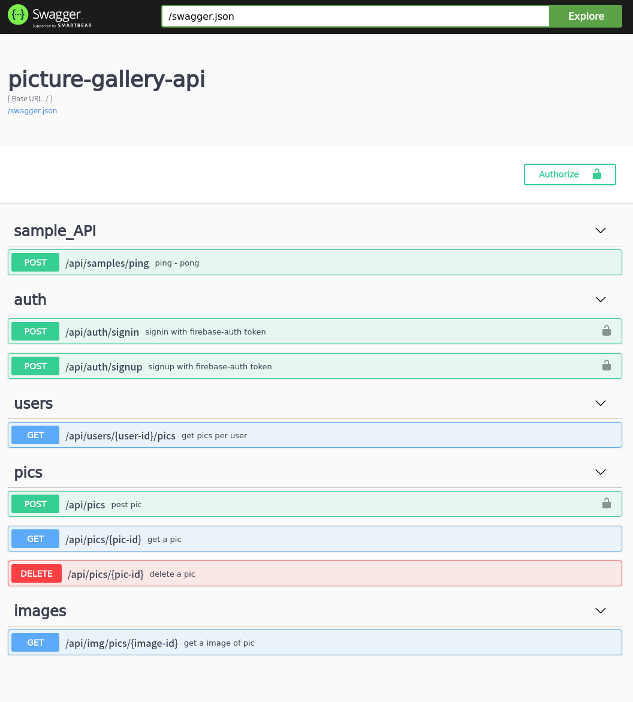
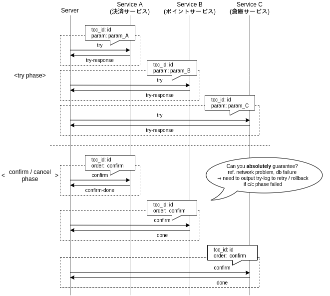

- [画像をローカルに保存する](#org1d7d273)
- [画像の REST のフロー確認](#org16ade1c)
  - [post](#orgbd0ba32)
  - [get](#orge5375d5)
  - [update](#org8ed31ae)
  - [delete](#orgb05fe04)
  - [user&rsquo;s image list](#orgc754f2c)
    - [get](#orgf62f60e)
- [ドメイン・ハンドラの作成](#org9b12223)
  - [ドメイン](#org6691cda)
  - [ハンドラ](#org56f35ed)
- [infrastructure の作成](#org166b0a6)
- [interface の組み込み](#orgba3eff1)
- [動作確認](#orgdcfd8c2)
- [付録](#org64589b6)
  - [Repository 内に Transaction を封じ込める](#orga58980c)
    - [同一 サービス 内での Transaction](#orgafa21fd)
    - [複数サービスをまたいだ Transaction](#orgff162dc)

\##+options: &rsquo;:t \*:t -:t ::t <:t H:3 \n:nil ^:t arch:headline author:t

本稿では、画像を投稿し、最近の数件を閲覧することができる簡易サービスを想定し、以前までに作った Auth と組み合わせた API 開発を進めていきます。

また、本稿では最も実装に難儀するトランザクションの処理を Repository 内に封じ込める / TCC (try-confirm/catch) を用いることで解決します [7.1](#orga58980c)。

<a id="org1d7d273"></a>

# 画像をローカルに保存する

本ガイドでは、画像をローカルに保存します。 一般には、GCS などの外部ストレージを利用することが多いのですが、連携に関する話をまとめるには紙面と時間が足りないので (もう 2 万年くらい使っていますね)、 ローカルに保存、というシンプルな方法を利用します。

Clojure で画像ファイルを保存する方法は、 `javax.imageio.ImageIO/write` 関数を用いることです。 名前空間からして Java の機能を使っていますが、実際そのとおりです。 このように優秀な Java のドキュメント付きライブラリを使える点が Clojure の強みの一つです。

```clojure
;; docs https://docs.oracle.com/javase/jp/8/docs/api/javax/imageio/ImageIO.html
(import javax.imageio.ImageIO)

(def image (ImageIO/read (io/file "resources/sample.png")))

(ImageIO/write image "png" (io/file "resources/copy-sample.png"))
;; return true (success) / false (failure)
;; catch IllegalArgumentException ... any parameter is null
;;       IOException              ... write error
```

<a id="org16ade1c"></a>

# 画像の REST のフロー確認

base-URL は、 `/api/pics` とします。 なお、post / delete については header に認証情報が付与されているものとします。

<a id="orgbd0ba32"></a>

## post

画像ファイルである images は、json で扱うことが難しいので、FormData を利用する。

- request

  ```json
  {
    "images": ["<image-file>"],
    "title": "<title>",
    "description(optional)": "<description>"
  }
  ```

- response

  ```json
  {
    "id": "<id>"
  }
  ```

<a id="orge5375d5"></a>

## get

- request (query)

  ```json
  {
    "id": "<id>"
  }
  ```

- response

  ```json
  {
      "id": "<id>",
      "user-id": "<user-id>"
      "title": "<title>",
      "description(optional)": "<description>",
      "created_at": "<created_at as long number>",
      "image-urls": ["<image-url>"]
  }
  ```

<a id="org8ed31ae"></a>

## update

今回は実装しません。

<a id="orgb05fe04"></a>

## delete

- request

  ```json
  {
    "id": "<id>"
  }
  ```

- response なし、成功であれば `204`

<a id="orgc754f2c"></a>

## user&rsquo;s image list

ユーザで絞り込んだ画像のリスト、と解釈し、 base-URL を `/api/users/<user-id>/pics` とします。

<a id="orgf62f60e"></a>

### get

簡単のために、pagination を offset 法で実装することを前提に request query を組み立てています。 offset 法は、投稿系の REST において検索速度上推奨できるものではないのですが、実装が非常に容易です。

- request (query)

  ```json
  {
    "page-id": "<page-index>"
  }
  ```

- response `description` は長い文字列を想定しており、 list 表示では必要としていないので省略します。 `image-url` はリスト表示の際に pic 内の 1 枚画像のみ参照する仕様を想定し、 `image-urls[0]` とします。

  ```json
  [
    {
      "id": "<id>",
      "title": "<title>",
      "created_at": "<created_at as long number>",
      "image-url": "<image-url>"
    }
  ]
  ```

<a id="org9b12223"></a>

# ドメイン・ハンドラの作成

<a id="org6691cda"></a>

## ドメイン

```clojure
(ns picture-gallery.domain.pics
  (:require [clojure.java.io :as io]
            [clojure.spec.alpha :as s]
            [clojure.string]
            [picture-gallery.domain.users :as users-domain]
            [picture-gallery.domain.base :as base-domain]
            [picture-gallery.domain.auth :as auth-domain])
  (:import javax.imageio.ImageIO))

(def invalid-title-substrs
  ["fuck"])

(defn image-file? [image-file]
  (and (instance? java.io.File image-file)
       (some? (ImageIO/read image-file))))

(def min-title-length 0)
(def max-title-length 128)
(def min-description-length 0)
(def max-description-length 1024)
(def max-images-per-one-pic 3)

(defn acceptable-title? [title]
  (apply
   = false
   (mapv (partial clojure.string/includes? title)
         invalid-title-substrs)))

(s/def ::pic-id uuid?)
(s/def ::image-file image-file?)
(s/def ::title (s/and string?
                      #(< min-title-length (count %) max-title-length)
                      acceptable-title?))
(s/def ::description (s/and string?
                            #(< min-description-length (count %) max-description-length)))

(s/def ::image-url (s/and string? #(clojure.string/starts-with? % "http")))
(s/def ::image-files (s/coll-of ::image-file :min-count 1 :max-count max-images-per-one-pic))
(s/def ::image-urls (s/coll-of ::image-url :min-count 1 :max-count max-images-per-one-pic))

;; model


(s/def ::pic-create-model
  (s/keys :req-un [::users-domain/user-id ::pic-id ::image-files ::title]
          :opt-un [::description]))

(s/def ::pic-model
  (s/keys :req-un [::users-domain/user-id ::pic-id ::image-urls ::title ::base-domain/created_at]
          :opt-un [::description]))

(s/def ::pics-model
  (s/coll-of ::pic-model))

;; usecase
(s/def ::pic-post-input
  (s/keys :req-un [::auth-domain/encrypted-id-token ::image-files ::title]
          :opt-un [::description]))

(s/def ::pic-post-output
  (s/keys :req-un [::pic-id]))

(s/def ::pic-get-input
  (s/keys :req-un [::pic-id]))

(s/def ::pic-get-output
  (s/keys :req-un [::pics-model]))

(s/def ::pic-delete-input
  (s/keys :req-un [::auth-domain/encrypted-id-token ::pic-id]))
```

```clojure
(ns picture-gallery.domain.user-pics
  (:require [picture-gallery.domain.users :as users-domain]
            [picture-gallery.domain.pics :as pics-domain]
            [clojure.spec.alpha :as s]))
;; usecase
(s/def ::user-pics-get-input
  (s/keys :req-un [::users-domain/user-id]))

(s/def ::user-pics-get-output
  (s/keys :req-un [::pics-domain/pics-model]))
```

<a id="org56f35ed"></a>

## ハンドラ

image-db はこのあと実装する、画像を保存する infrastructure (予定) です。

```clojure
(ns picture-gallery.infrastructure.router.pics
  (:require [picture-gallery.domain.openapi.pics :as pics-openapi]))

(defn pics-router [db auth image-db]
  ["/pics"
   {:swagger {:tags ["pics"]}}
   [""
    {:swagger {:tags ["pics"]}
     :post {:summary "post pic"
            :swagger {:security [{:Bearer []}]}
            :parameters {:multipart pics-openapi/pics-post-parameters-multipart}
            :responses {200 {:body ::pics-openapi/pics-post-response}}
            :handler (fn [input-data]
                       {:status 200
                        :body {:id "1"}})}}]
   ["/:pic-id"
    [""
     {:get {:summary "get a pic"
            :parameters {:path {:pic-id ::pics-openapi/id}}
            :responses {200 {:body ::pics-openapi/pic-get-response}}
            :handler (fn [input-data]
                       {:statsu 200
                        :body {}})}
      :delete {:summary "delete a pic"
               :parameters {:path {:pic-id ::pics-openapi/id}}
               :responses {204 {}}
               :handler (fn [input-data]
                          {:status 204
                           :body {}})}}]]])
```

ユーザの中にある pics という認識に立つと、 `users` namespace のほうが自然かもしれません。

```clojure
(ns picture-gallery.infrastructure.router.users
  (:require [picture-gallery.domain.openapi.pics :as pics-openapi]
            [picture-gallery.domain.openapi.users :as users-openapi]))

(defn users-router [db auth]
  ["/users"
   {:swagger {:tags ["users"]}}
   ["/:user-id"
    ["/pics"
     {:get {:summary "get pics per user"
            :parameters {:query {:page-id pos-int?}
                         :path {:user-id ::users-openapi/user-id}}
            :responses {200 {:body ::pics-openapi/user-pics-get-response}}
            :handler (fn [input-data]
                       {:status 200
                        :body {}})}}]]])
```

画像そのもののへの URL についても別の namespace に切り出しました。

```clojure
(ns picture-gallery.infrastructure.router.images
  (:require [picture-gallery.domain.openapi.pics :as pics-openapi]))

(defn images-router [db image-db]
  ["/img"
   {:swagger {:tags ["images"]}}
   ["/pics/:image-id"
    {:get {:summary "get a image of pic"
           :parameters {:path {:image-id ::pics-openapi/image-id}}
           :swagger {:produces ["image/png"]}
           :handler (fn [input-data]
                      {:status 200
                       :body {}})}}]])
```

ここまでで swagger は次の通りになります。



<a id="org166b0a6"></a>

# infrastructure の作成

<a id="orgba3eff1"></a>

# interface の組み込み

<a id="orgdcfd8c2"></a>

# 動作確認

<a id="org64589b6"></a>

# 付録

<a id="orga58980c"></a>

## Repository 内に Transaction を封じ込める

Transaction は副作用を伴う関数を ACID に扱いたいときに用います。 ACID の A は原子性 (atomicity) であり、原子をやり取りするのに一つの Repository を使おう、という立場であれば、この主張は正しいと言えます。

<a id="orgafa21fd"></a>

### 同一 サービス 内での Transaction

例えば、銀行の預金テーブル Y があったとき、Ron から Potter に 20 ポンド 送金があったとき、 Ron の預金を減らす処理と Potter の預金を増やす処理は ACID でなければなりません。

このとき、次の 2 つのパターンが考えられます。

1.  usecase 側に transaction を漏らして、SQL を実行
2.  repository 内で Ron と Potter の預金を操作する

参考: <https://github.com/duct-framework/duct/wiki/Boundaries>

しかし、実際の Transaction の利用場面では、 (**同一 DB 上の**) いくつかの異なるテーブルにまたがって ACID な操作を行いたいケースもあります。 例えばソーシャルゲームのポイントガチャがそれに当たります。 (ポイントテーブル Z のポイント z を減らして、アイテムテーブル I にアイテム i を追加する)

このときには、次の 2 つのパターンが考えられます (他にもありますが簡単のため 2 つとします)。

1.  usecase 側に 該当 DB の transaction を漏らして、 transaction 内で 複数の repository を操作する。
2.  複数テーブルで表されるモデルを 1 つのモデルとみなして、 1 つの repository とする。

2 については、モデルをどう効率よく設計できているかに依存した方針です。また、 ORM を意識したモデル設計とは異なります。 しかしモデルを原子とみなす考え方をすると、 2 の実装を考えることもできます。

ただし弱点として、新しい機能開発をする際に、モデル (= transaction の単位) を見直す必要があります。 言い換えると、 1 を用いることで、モデルが Atomic でなくとも usecase 内部で Atomic な単位を生成することができるので、お手軽に拡張することができます。

<a id="orgff162dc"></a>

### 複数サービスをまたいだ Transaction

同一 DB だけで完結する transaction は上記解決策を考えればよいのですが、例えば決済サービスと連動して自社 DB を操作します、となると話が変わります。 2 つのサービスを連携させた transaction は通常生成することが困難です。 そのため、TCC (try-confirm/cancel) というアプローチが用いられるケースが有名所さんとなっています。

TCC とは、try-phase, confirm/cancel-phase の 2 つのフェーズを用いた transaction 方式です。

try-phase とは、各サービスに対してリソースの仮押さえを行う phase です。ここで、抑えたリソースは **必ず** 確定 (confirm) / 棄却 (cancel) ができることが保証されています。 confirm/cancel-phase とは、 すべてのサービスで try が成功すればリソース消費の確定 (confirm)を、一つでも失敗すれば棄却 (cancel) する phase です。



TCC の場合は、 transaction を DB やサービスの repository から usecase へ持ち込む必要がないため、本手続きは usecase 内に書くことも容易です (実際に本ガイドでは、 **同一サービス内の操作は同一 repository** に、 **複数サービスにまたがる操作は TCC を用いて usecase 内** に落としています)。

勿論 TCC ではなく、ログを吐き出して記録することでサーバ外で容易に error-catch / retry できるようにする手法などもあるので、たくさん実験してみて下さい (少なくとも本ガイドは全くフレームワークやライブラリの制約が削ぎ落とされているので、実装は可能なはずです)。

参考:

- <https://qiita.com/nk2/items/d9e9a220190549107282#tcc%E3%83%91%E3%82%BF%E3%83%BC%E3%83%B3>
- <https://engineering.mercari.com/blog/entry/2019-06-07-155849/>
