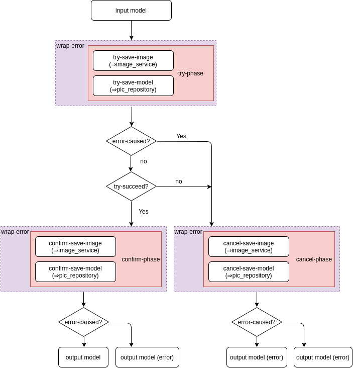

- [画像をローカルに保存する](#orgb536bb5)
- [画像の REST のフロー確認](#org75977bf)
  - [post](#org773e138)
  - [get](#org22f52d7)
  - [update](#org4080fac)
  - [delete](#org79567d4)
  - [user&rsquo;s image list](#org97c8069)
    - [get](#org4e46ae4)
- [ドメイン・ハンドラの作成](#org22a6133)
  - [ドメイン](#org6c9d42d)
  - [ハンドラ](#org9323f41)
- [infrastructure の実装](#orge4167e0)
- [interface の実装](#org2d5ba3a)
  - [画像を保存するための interface](#orgedda8b0)
  - [Pic 情報を保存するための SQL interface](#org2bc289e)
- [interface の組み込み](#orge9a80d8)
- [動作確認](#org95c1c42)
- [付録](#org977b16d)
  - [Repository 内に Transaction を封じ込める](#orga38ef62)
    - [同一 サービス 内での Transaction](#org9b17d67)
    - [複数サービスをまたいだ Transaction](#orgee393f2)

\##+options: &rsquo;:t \*:t -:t ::t <:t H:3 \n:nil ^:t arch:headline author:t

~~安心して下さい。長い戦いは終わったので、後は消化試合です~~ 本稿では、画像を投稿し、最近の数件を閲覧することができる簡易サービスを想定し、以前までに作った Auth と組み合わせた API 開発を進めていきます。

また、本稿では最も実装に難儀するトランザクションの処理を Repository 内に封じ込める / TCC (try-confirm/catch) を用いることで解決します [8.1](#orga38ef62)。

<a id="orgb536bb5"></a>

# 画像をローカルに保存する

本ガイドでは、画像をローカルに保存します。 一般には、GCS などの外部ストレージを利用することが多いのですが、連携に関する話をまとめるには紙面と時間が足りないので (もう 2 万年くらい使っていますね)、 ローカルに保存、というシンプルな方法を利用します。

Clojure で画像ファイルを保存する方法は、 `javax.imageio.ImageIO/write` 関数を用いることです。 名前空間からして Java の機能を使っていますが、実際そのとおりです。 このように優秀な Java のドキュメント付きライブラリを使える点が Clojure の強みの一つです。

```clojure
;; docs https://docs.oracle.com/javase/jp/8/docs/api/javax/imageio/ImageIO.html
(import javax.imageio.ImageIO)

(def image (ImageIO/read (io/file "resources/sample.png")))

(ImageIO/write image "png" (io/file "resources/copy-sample.png"))
;; return true (success) / false (failure)
;; catch IllegalArgumentException ... any parameter is null
;;       IOException              ... write error
```

<a id="org75977bf"></a>

# 画像の REST のフロー確認

base-URL は、 `/api/pics` とします。 なお、post / delete については header に認証情報が付与されているものとします。

<a id="org773e138"></a>

## post

画像ファイルである images は、json で扱うことが難しいので、FormData を利用する。

- request

  ```json
  {
    "images": ["<image-file>"],
    "title": "<title>",
    "description(optional)": "<description>"
  }
  ```

- response

  ```json
  {
    "id": "<id>"
  }
  ```

<a id="org22f52d7"></a>

## get

- request (query)

  ```json
  {
    "id": "<id>"
  }
  ```

- response

  ```json
  {
    "id": "<id>",
    "user-id": "<user-id>",
    "title": "<title>",
    "description(optional)": "<description>",
    "created_at": "<created_at as long number>",
    "image-urls": ["<image-url>"]
  }
  ```

<a id="org4080fac"></a>

## update

今回は実装しません。

<a id="org79567d4"></a>

## delete

- request

  ```json
  {
    "id": "<id>"
  }
  ```

- response なし、成功であれば `204`

<a id="org97c8069"></a>

## user&rsquo;s image list

ユーザで絞り込んだ画像のリスト、と解釈し、 base-URL を `/api/users/<user-id>/pics` とします。

<a id="org4e46ae4"></a>

### get

簡単のために、pagination を offset 法で実装することを前提に request query を組み立てています。 offset 法は、投稿系の REST において検索速度上推奨できるものではないのですが、実装が非常に容易です。

- request (query)

  ```json
  {
    "page-id": "<page-index>"
  }
  ```

- response `description` は長い文字列を想定しており、 list 表示では必要としていないので省略します。 `image-url` はリスト表示の際に pic 内の 1 枚画像のみ参照する仕様を想定し、 `image-urls[0]` とします。

  ```json
  [
    {
      "id": "<id>",
      "title": "<title>",
      "created_at": "<created_at as long number>",
      "image-url": "<image-url>"
    }
  ]
  ```

<a id="org22a6133"></a>

# ドメイン・ハンドラの作成

<a id="org6c9d42d"></a>

## ドメイン

```clojure
(ns picture-gallery.domain.pics
  (:require [clojure.java.io :as io]
            [clojure.spec.alpha :as s]
            [clojure.string]
            [picture-gallery.domain.users :as users-domain]
            [picture-gallery.domain.base :as base-domain]
            [picture-gallery.domain.auth :as auth-domain])
  (:import javax.imageio.ImageIO))

(def invalid-title-substrs
  ["fuck"])

(defn image-file? [image-file]
  (and (instance? java.io.File image-file)
       (some? (ImageIO/read image-file))))

(def min-title-length 0)
(def max-title-length 128)
(def min-description-length 0)
(def max-description-length 1024)
(def max-images-per-one-pic 3)

(defn acceptable-title? [title]
  (apply
   = false
   (mapv (partial clojure.string/includes? title)
         invalid-title-substrs)))

(s/def ::pic-id uuid?)
(s/def ::image-file image-file?)
(s/def ::title (s/and string?
                      #(< min-title-length (count %) max-title-length)
                      acceptable-title?))
(s/def ::description (s/and string?
                            #(< min-description-length (count %) max-description-length)))

(s/def ::image-url string?)
(s/def ::image-files (s/coll-of ::image-file :min-count 1 :max-count max-images-per-one-pic))
(s/def ::image-urls (s/coll-of ::image-url :min-count 1 :max-count max-images-per-one-pic))

;; model


(s/def ::pic-create-model
  (s/keys :req-un [::users-domain/user-id ::pic-id ::image-files ::title]
          :opt-un [::description]))

(s/def ::pic-model
  (s/keys :req-un [::users-domain/user-id ::pic-id ::image-urls ::title ::base-domain/created_at]
          :opt-un [::description]))

(s/def ::pics-model
  (s/coll-of ::pic-model))

;; usecase
(s/def ::pic-post-input
  (s/keys :req-un [::auth-domain/encrypted-id-token ::image-files ::title]
          :opt-un [::description]))

(s/def ::pic-post-output
  (s/keys :req-un [::pic-id]))

(s/def ::pic-get-input
  (s/keys :req-un [::pic-id]))

(s/def ::pic-get-output
  (s/keys :req-un [::pics-model]))

(s/def ::pic-delete-input
  (s/keys :req-un [::auth-domain/encrypted-id-token ::pic-id]))
```

```clojure
(ns picture-gallery.domain.user-pics
  (:require [picture-gallery.domain.users :as users-domain]
            [picture-gallery.domain.pics :as pics-domain]
            [clojure.spec.alpha :as s]))
;; usecase
(s/def ::user-pics-get-input
  (s/keys :req-un [::users-domain/user-id]))

(s/def ::user-pics-get-output
  (s/keys :req-un [::pics-domain/pics-model]))
```

<a id="org9323f41"></a>

## ハンドラ

image-db はこのあと実装する、画像を保存する infrastructure (予定) です。

```clojure
(ns picture-gallery.infrastructure.router.pics
  (:require [picture-gallery.domain.openapi.pics :as pics-openapi]))

(defn pics-router [db auth image-db]
  ["/pics"
   {:swagger {:tags ["pics"]}}
   [""
    {:swagger {:tags ["pics"]}
     :post {:summary "post pic"
            :swagger {:security [{:Bearer []}]}
            :parameters {:multipart pics-openapi/pics-post-parameters-multipart}
            :responses {200 {:body ::pics-openapi/pics-post-response}}
            :handler (fn [input-data]
                       {:status 200
                        :body {:id "1"}})}}]
   ["/:pic-id"
    [""
     {:get {:summary "get a pic"
            :parameters {:path {:pic-id ::pics-openapi/id}}
            :responses {200 {:body ::pics-openapi/pic-get-response}}
            :handler (fn [input-data]
                       {:statsu 200
                        :body {}})}
      :delete {:summary "delete a pic"
               :parameters {:path {:pic-id ::pics-openapi/id}}
               :responses {204 {}}
               :handler (fn [input-data]
                          {:status 204
                           :body {}})}}]]])
```

ユーザの中にある pics という認識に立つと、 `users` namespace のほうが自然かもしれません。

```clojure
(ns picture-gallery.infrastructure.router.users
  (:require [picture-gallery.domain.openapi.pics :as pics-openapi]
            [picture-gallery.domain.openapi.users :as users-openapi]))

(defn users-router [db auth]
  ["/users"
   {:swagger {:tags ["users"]}}
   ["/:user-id"
    ["/pics"
     {:get {:summary "get pics per user"
            :parameters {:query {:page-id pos-int?}
                         :path {:user-id ::users-openapi/user-id}}
            :responses {200 {:body ::pics-openapi/user-pics-get-response}}
            :handler (fn [input-data]
                       {:status 200
                        :body {}})}}]]])
```

画像そのもののへの URL についても別の namespace に切り出しました。

```clojure
(ns picture-gallery.infrastructure.router.images
  (:require [picture-gallery.domain.openapi.pics :as pics-openapi]))

(defn images-router [db image-db]
  ["/img"
   {:swagger {:tags ["images"]}}
   ["/pics/:image-id"
    {:get {:summary "get a image of pic"
           :parameters {:path {:image-id ::pics-openapi/image-id}}
           :swagger {:produces ["image/png"]}
           :handler (fn [input-data]
                      {:status 200
                       :body {}})}}]])
```

ここまでで swagger は次の通りになります。


<a id="orge4167e0"></a>

# infrastructure の実装

ローカルに画像を保存するために、image-db の infrastructure を作ります。 今回は、保存先の親ディレクトリ (`parent-dir`) を持つだけの infrastructure とします。

```clojure
(ns picture-gallery.infrastructure.image-db.core
  (:require [integrant.core :as ig]))

(defrecord LocalImageDBBoundary [image-db])

(defmethod ig/init-key ::image-db
  [_ {:keys [env]}]
  (let [parent-dir (:local-image-db-parent-dir env)]
    (->LocalImageDBBoundary {:parent-dir parent-dir})))
```

infrastructure を書いたので、config を編集します。

```clojure
{:picture-gallery.infrastructure.env/env {}
 :picture-gallery.infrastructure.logger/logger {:env #ig/ref :picture-gallery.infrastructure.env/env}
 :picture-gallery.infrastructure.firebase.core/firebase {:env #ig/ref :picture-gallery.infrastructure.env/env}
 :picture-gallery.infrastructure.sql.sql/sql {:env #ig/ref :picture-gallery.infrastructure.env/env
                                              :logger #ig/ref :picture-gallery.infrastructure.logger/logger}
 :picture-gallery.infrastructure.image-db.core/image-db {:env #ig/ref :picture-gallery.infrastructure.env/env}
 :picture-gallery.infrastructure.sql.migrate/migration  {:env #ig/ref :picture-gallery.infrastructure.env/env
                                                         :operation :migrate
                                                         :logger #ig/ref :picture-gallery.infrastructure.logger/logger}
 :picture-gallery.infrastructure.router.core/router {:env #ig/ref :picture-gallery.infrastructure.env/env
                                                     :auth #ig/ref :picture-gallery.infrastructure.firebase.core/firebase
                                                     :db #ig/ref :picture-gallery.infrastructure.sql.sql/sql}
 :picture-gallery.infrastructure.server/server {:env #ig/ref :picture-gallery.infrastructure.env/env
                                                :router #ig/ref :picture-gallery.infrastructure.router.core/router
                                                :port 3000}}
```

`env.clj` `profiles.clj` についても、以前と同様に編集します。

<a id="org2d5ba3a"></a>

# interface の実装

interface も前回と同様に、 `defprotcol` を書いて、実装を書くだけです。

<a id="orgedda8b0"></a>

## 画像を保存するための interface

protocol は次の通り。保存、取得、削除のみの小さい interface です。

```clojure
(ns picture-gallery.interface.gateway.image-db.pics-service
  (:import (java.io File))
  (:require [clojure.spec.alpha :as s]
            [picture-gallery.domain.pics :as pics-domain]
            [integrant.core :as ig]
            [clojure.java.io :as io]))

(defprotocol Pics
  (get-pic-image [image-db blob])
  (save-pic-image [image-db ^File image])
  (delete-pic-image [image-db blob]))

(defn pics-service? [inst]
  (satisfies? Pics inst))

(s/def ::pics-service pics-service?)

(s/fdef get-pic-image
  :args (s/cat :image-db ::pics-service
               :blob ::pics-domain/image-url)
  :ret (s/or :exist ::pics-domain/image-file
             :not-exist empty?))

(s/fdef save-pic-image
  :args (s/cat :image-db ::pics-service
               :image ::pics-domain/image-file)
  :ret ::pics-domain/image-url)

(s/fdef delete-pic-image
  :args (s/cat :image-db ::pics-service
               :blob ::pics-domain/image-url)
  :ret (s/and int? (partial <= 0)))
```

<details><summary>impl</summary>

```clojure
(ns picture-gallery.interface.gateway.image-db.local.pics-service
  (:require [picture-gallery.interface.gateway.image-db.pics-service :refer [Pics]]
            [clojure.java.io :as io]
            [taoensso.timbre :as timbre]))

(extend-protocol Pics
  picture_gallery.infrastructure.image_db.core.LocalImageDBBoundary

  (get-pic-image [{{:keys [parent-dir]} :image-db} blob]
    (let [file (io/file parent-dir "pic" blob)]
      (if (.isFile file) file nil)))

  (save-pic-image [{{:keys [parent-dir]} :image-db} image]
    (try
      ;; check duplicate
      (loop [blob (java.util.UUID/randomUUID)
             retry 0]
        (let [file (io/file parent-dir "pic" (.toString blob))]
          (cond
            (> retry 10) (throw (ex-info "save pic's image failed: at apply unique random uuid"))
            (and file (.isFile file)) (recur (java.util.UUID/randomUUID) (inc retry))
            :else (do (io/copy image file)
                      (.toString blob)))))
      (catch java.io.IOException e
        (timbre/error "Pics save image Error: " (.getMessage e))
        (throw (ex-info "failed to save image" {:parent-dir parent-dir :image image})))))

  (delete-pic-image [{{:keys [parent-dir]} :image-db} blob]
    (try
      (io/delete-file (io/file parent-dir "pic" blob)) 1
      (catch Exception e
        (timbre/warn "Pics delete image Error: " (.getMessage e)) 0))))
```

</details>

<a id="org2bc289e"></a>

## Pic 情報を保存するための SQL interface

前回ユーザ用に作った interface と同様に作ります。

今回は、1 つの投稿について、複数枚の画像が投稿できることを（長期的に）想定しているので、 テーブルを分離し( one-many )ます。

そして、usecase に transaction を持ち込まないため、この複数テーブルの操作を一つの repository に押し込んでしまいます。

```clojure
(ns picture-gallery.interface.gateway.database.pics-repository
  (:require [clojure.spec.alpha :as s]
            [picture-gallery.domain.pics :as pics-domain]
            [picture-gallery.domain.users :as users-domain]
            [picture-gallery.domain.base :as base-domain]
            [clojure.java.io :as io]
            [integrant.core :as ig]
            [orchestra.spec.test :as st]
            [next.jdbc :as jdbc]))

(defprotocol Pics
  (get-pics [db])
  (get-pics-by-user [db user-id page-id])
  (get-pic [db pic-id])
  (create-pic [db pic-create-model state])
  (update-pic-state [db pic-id state])
  (delete-pic [db pic-id logical?]))

(defn pics-repository? [inst]
  (satisfies? Pics inst))

(s/def ::pics-repository pics-repository?)

(s/fdef get-pics
  :args (s/cat :db ::pics-repository)
  :ret ::pics-domain/pics-model)

(s/fdef get-pics-by-user
  :args (s/cat :db ::pics-repository
               :user-id ::users-domain/user-id
               :page-id pos-int?)
  :ret ::pics-domain/pics-model)

(s/fdef get-pic
  :args (s/cat :db ::pics-repository
               :pic-id ::pics-domain/pic-id)
  :ret (s/or :exist ::pics-domain/pic-model
             :not-exist empty?))

(s/fdef create-pic
  :args (s/cat :db ::pics-repository
               :pic-create-model ::pics-domain/pic-create-model
               :state ::base-domain/tcc-state)
  :ret (s/tuple ::pics-domain/pic-model ::base-domain/tcc-state))

(s/fdef update-pic-state
  :args (s/cat :db ::pics-repository
               :pic-id ::pics-domain/pic-id
               :state ::base-domain/tcc-state)
  :ret (s/and int? (partial <= 0)))

(s/fdef delete-pic
  :args (s/cat :db ::pics-repository
               :pic-id ::pics-domain/pic-id
               :logical? boolean?)
  :ret (s/and int? (partial <= 0)))
```

<details><summary>impl(複数テーブルの操作のため、かなり長いです)</summary>

```clojure
(ns picture-gallery.interface.gateway.database.sql.pics-repository
  (:require [picture-gallery.interface.gateway.database.pics-repository :refer [Pics]]
            [picture-gallery.interface.gateway.database.sql.utils :as sql-utils]
            [next.jdbc :as jdbc]
            [clojure.string]
            [next.jdbc.sql :as njs]
            [next.jdbc.types :refer [as-other]]
            [clojure.spec.alpha :as s]))

(defn pic-create-model->sql [{:keys [user-id title description]} state]
  (cond->
   {:user_id user-id
    :title title
    :tcc_state (as-other (name state))}
    description (assoc :description description)))

(defn pic-image-urls->sql [image-urls]
  (vec (map-indexed  (fn [idx image-url]
                       {:blob image-url
                        :index idx}) image-urls)))

(defn sql->pic-model [sql-pic sql-pic-image]
  (let [{:keys [id user_id title description created_at updated_at is_deleted tcc_state]} sql-pic
        image-urls (mapv #(:blob %) (sort-by :index sql-pic-image))]
    (if-not id
      nil
      (cond->
       {:pic-id id
        :user-id user_id
        :title title
        :image-urls image-urls
        :created-at (sql-utils/sql-to-long created_at)
        :is-deleted is_deleted
        :tcc-state tcc_state}
        description (assoc :description description)
        updated_at (assoc :updated-at (sql-utils/sql-to-long updated_at))))))

(def sql-basic-selection
  "SELECT * FROM pics INNER JOIN pic_images ON (pics.id = pic_images.id)")

(extend-protocol Pics
  picture_gallery.infrastructure.sql.sql.Boundary

  (get-pics [{:keys [spec]}]
    (with-open [conn (jdbc/get-connection (:datasource spec))]
      (let [pics (jdbc/execute! conn [(clojure.string/join " " [sql-basic-selection "limit 100"])] sql-utils/default-jdbc-option)
            pics-images (mapv #(jdbc/execute! conn ["SELECT * FROM pic_images WHERE id = ?" (:id %)] sql-utils/default-jdbc-option) pics)]
        (mapv sql->pic-model pics pics-images))))

  (get-pics-by-user [{:keys [spec]} user-id page-id]
    (with-open [conn (jdbc/get-connection (:datasource spec))]
      (let [sql-offset (* 20 (dec page-id))
            pics (jdbc/execute! conn ["SELECT * FROM pics WHERE user_id = ? AND is_deleted = false AND tcc_state = ? limit 20 offset ?" user-id (as-other "confirm") sql-offset] sql-utils/default-jdbc-option)
            pics-head-images (mapv #(jdbc/execute! conn ["SELECT * FROM pic_images WHERE id = ? AND index = 0" (:id %)] sql-utils/default-jdbc-option) pics)]
        (mapv sql->pic-model pics pics-head-images))))

  (get-pic [{:keys [spec]} pic-id]
    (with-open [conn (jdbc/get-connection (:datasource spec))]
      (sql->pic-model
       (jdbc/execute-one! conn ["SELECT * FROM pics WHERE id = ? AND is_deleted = false AND tcc_state = ?" pic-id (as-other "confirm")] sql-utils/default-jdbc-option)
       (jdbc/execute! conn ["SELECT * FROM pic_images WHERE id = ?" pic-id] sql-utils/default-jdbc-option))))

  (create-pic [{:keys [spec]} pic-create-model state]
    (let [sql-pic-create-model (pic-create-model->sql pic-create-model state)
          sql-pic-image-urls (pic-image-urls->sql (:image-urls pic-create-model))]
      (jdbc/with-transaction [tx (:datasource spec)]
        (let [pic-id (loop [pic-id (java.util.UUID/randomUUID) retry 0]
                       (cond
                         (> retry 10) (throw (ex-info "pic's unique random uuid generation failed" {:pic-create-model pic-create-model}))
                         (nil? (jdbc/execute-one! tx ["SELECT * FROM pics WHERE id = ?" pic-id])) pic-id
                         :else (recur (java.util.UUID/randomUUID) (inc retry))))
              pic-result (njs/insert! tx :pics (assoc sql-pic-create-model :id pic-id) sql-utils/default-jdbc-option)
              pic-image-result (njs/insert-multi! tx :pic_images [:blob :id :index] (mapv (fn [{:keys [blob index]}] [blob pic-id index]) sql-pic-image-urls) sql-utils/default-jdbc-option)]
          [(sql->pic-model pic-result pic-image-result) (keyword (:tcc_state pic-result))]))))

  (update-pic-state [{:keys [spec]} pic-id state]
    (sql-utils/update! spec :pics {:tcc_state (as-other (name state))} {:id pic-id}))

  (delete-pic [{:keys [spec]} pic-id logical?]
    (if logical?
      (sql-utils/logical-delete! spec :pics {:id pic-id})
      (sql-utils/physical-delete! spec :pics {:id pic-id}))))
```

</details>

<a id="orge9a80d8"></a>

# interface の組み込み

usecase 層に interface を組み込んでいきます。 一番問題となるのは、投稿処理の部分で、TCC パターンを組み合わせて実装することになります。

そこで、まずは実装フローを図にしてみます。



<a id="org95c1c42"></a>

# 動作確認

<a id="org977b16d"></a>

# 付録

<a id="orga38ef62"></a>

## Repository 内に Transaction を封じ込める

Transaction は副作用を伴う関数を ACID に扱いたいときに用います。 ACID の A は原子性 (atomicity) であり、原子をやり取りするのに一つの Repository を使おう、という立場であれば、この主張は正しいと言えます。

<a id="org9b17d67"></a>

### 同一 サービス 内での Transaction

例えば、銀行の預金テーブル Y があったとき、Ron から Potter に 20 ポンド 送金があったとき、 Ron の預金を減らす処理と Potter の預金を増やす処理は ACID でなければなりません。

このとき、次の 2 つのパターンが考えられます。

1.  usecase 側に transaction を漏らして、SQL を実行
2.  repository 内で Ron と Potter の預金を操作する

参考: <https://github.com/duct-framework/duct/wiki/Boundaries>

しかし、実際の Transaction の利用場面では、 (**同一 DB 上の**) いくつかの異なるテーブルにまたがって ACID な操作を行いたいケースもあります。 例えばソーシャルゲームのポイントガチャがそれに当たります。 (ポイントテーブル Z のポイント z を減らして、アイテムテーブル I にアイテム i を追加する)

このときには、次の 2 つのパターンが考えられます (他にもありますが簡単のため 2 つとします)。

1.  usecase 側に 該当 DB の transaction を漏らして、 transaction 内で 複数の repository を操作する。
2.  複数テーブルで表されるモデルを 1 つのモデルとみなして、 1 つの repository とする。

2 については、モデルをどう効率よく設計できているかに依存した方針です。また、 ORM を意識したモデル設計とは異なります。 しかしモデルを原子とみなす考え方をすると、 2 の実装を考えることもできます。

ただし弱点として、新しい機能開発をする際に、モデル (= transaction の単位) を見直す必要があります。 言い換えると、 1 を用いることで、モデルが Atomic でなくとも usecase 内部で Atomic な単位を生成することができるので、お手軽に拡張することができます。

<a id="orgee393f2"></a>

### 複数サービスをまたいだ Transaction

同一 DB だけで完結する transaction は上記解決策を考えればよいのですが、例えば決済サービスと連動して自社 DB を操作します、となると話が変わります。 2 つのサービスを連携させた transaction は通常生成することが困難です。 そのため、TCC (try-confirm/cancel) というアプローチが用いられるケースが有名所さんとなっています。

TCC とは、try-phase, confirm/cancel-phase の 2 つのフェーズを用いた transaction 方式です。

try-phase とは、各サービスに対してリソースの仮押さえを行う phase です。ここで、抑えたリソースは **必ず** 確定 (confirm) / 棄却 (cancel) ができることが保証されています。 confirm/cancel-phase とは、 すべてのサービスで try が成功すればリソース消費の確定 (confirm)を、一つでも失敗すれば棄却 (cancel) する phase です。


TCC の場合は、 transaction を DB やサービスの repository から usecase へ持ち込む必要がないため、本手続きは usecase 内に書くことも容易です (実際に本ガイドでは、 **同一サービス内の操作は同一 repository** に、 **複数サービスにまたがる操作は TCC を用いて usecase 内** に落としています)。

勿論 TCC ではなく、ログを吐き出して記録することでサーバ外で容易に error-catch / retry できるようにする手法などもあるので、たくさん実験してみて下さい (少なくとも本ガイドは全くフレームワークやライブラリの制約が削ぎ落とされているので、実装は可能なはずです)。

参考:

- <https://qiita.com/nk2/items/d9e9a220190549107282#tcc%E3%83%91%E3%82%BF%E3%83%BC%E3%83%B3>
- <https://engineering.mercari.com/blog/entry/2019-06-07-155849/>
